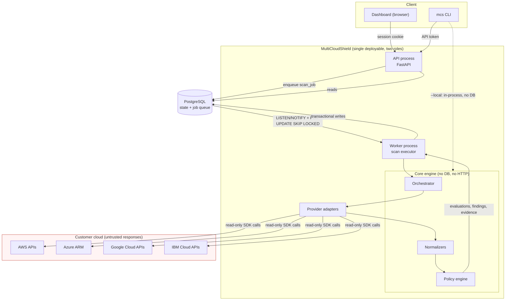
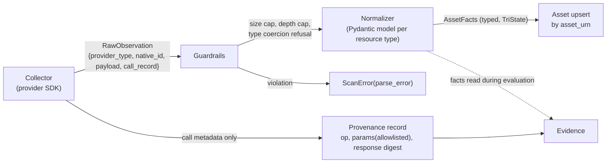
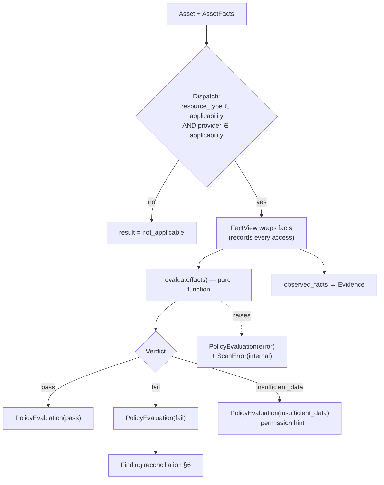
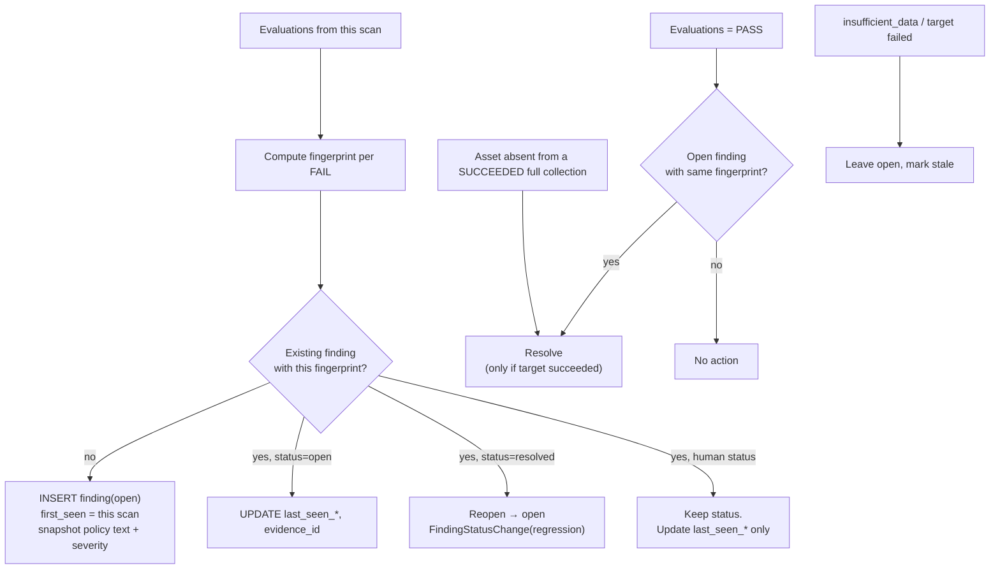
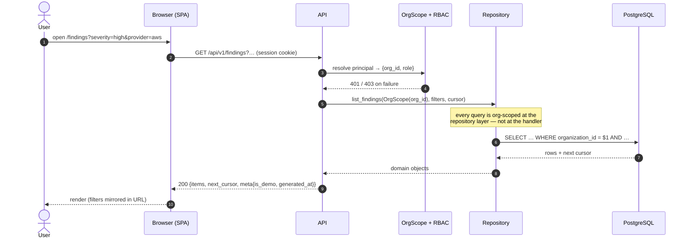
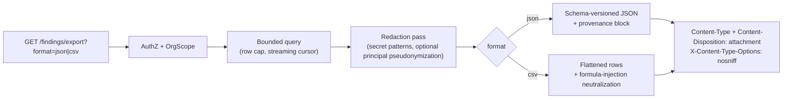
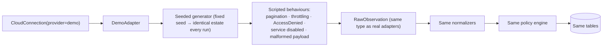

# Data Flows

Status: accepted for v0.1.0
Last updated: 2026-08-05

How data moves through MultiCloudShield, where it is transformed, and where it is trusted. Entity
definitions are in [domain-model.md](domain-model.md); the trust boundaries these flows cross are
enumerated in [security-boundaries.md](security-boundaries.md).

---

## 1. End-to-end overview



Two facts this diagram is meant to make obvious:

1. **The core engine has no database and no HTTP server dependency.** It consumes a connection
   descriptor and produces a result set. That is what makes `mcs scan --local` possible without a
   second implementation, and it is why persistence bugs cannot produce wrong findings
   ([ADR-0025](decisions/0025-stateless-local-scan-mode.md)).
2. **The worker, not the API, talks to customer clouds.** The API process makes no outbound cloud
   calls, so the request-serving surface has no egress path to abuse
   ([threat-model.md](threat-model.md) §T4).

---

## 2. Connection registration and connectivity test

```mermaid
sequenceDiagram
    autonumber
    actor Op as Operator
    participant API
    participant V as CredentialReferenceValidator
    participant DB as PostgreSQL
    participant W as Worker
    participant P as Provider adapter
    participant C as Cloud API

    Op->>API: POST /api/v1/connections {provider, scope_id, mechanism, reference}
    API->>V: validate(mechanism, reference)
    V-->>API: reject unknown keys / secret-shaped values (422, value never echoed)
    API->>DB: INSERT cloud_connection (enabled, never_tested)
    API-->>Op: 201 + connection (reference echoed with flagged fields omitted)

    Op->>API: POST /api/v1/connections/{id}/test
    API->>DB: enqueue job(kind=connection_test)
    API-->>Op: 202 + job handle
    W->>DB: claim job
    W->>P: resolve_credentials(mechanism, reference)
    Note over P: provider-native chain only;<br/>reads env/instance identity, never our DB
    P->>C: identity probe (STS GetCallerIdentity / ARM tenant list / …)
    C-->>P: identity or auth error
    loop each registered collector
        P->>C: cheapest permission probe (1 page, minimal scope)
        C-->>P: 200 | AccessDenied | ServiceDisabled
    end
    P-->>W: CapabilityReport{ok[], denied[{collector, missing_permission}], disabled[]}
    W->>DB: UPDATE connection (ok | degraded | failed, redacted detail)
```

The permission probe is what produces `degraded`. Reporting "connection works" when half the
collectors will silently fail is the failure mode this flow exists to prevent — the operator learns
about missing permissions at registration time, with the exact IAM action named, not weeks later as
an unexplained gap in coverage.

**Credential resolution never reads a secret from our database, because none is there.** The adapter
resolves credentials from the provider's own chain using the non-secret reference as configuration.

---

## 3. Scan orchestration

```mermaid
sequenceDiagram
    autonumber
    participant API
    participant DB as PostgreSQL
    participant W as Worker
    participant O as Orchestrator
    participant A as Adapter
    participant N as Normalizer
    participant PE as Policy engine

    API->>DB: INSERT scan(queued) + job(scan) [Idempotency-Key honoured]
    API-->>API: NOTIFY mcs_jobs
    W->>DB: SELECT ... FOR UPDATE SKIP LOCKED → claim, set lease_until
    W->>DB: scan → running, pin policy_bundle_version + engine_version
    W->>O: execute(scan, connection)

    O->>A: describe_scope() → regions/locations (intersected with allowlist)
    O->>DB: INSERT scan_targets (scope × collector)

    par bounded concurrency (semaphores: global / connection / provider)
        loop each scan_target
            W->>DB: check cancellation_requested_at
            O->>A: collect(target) — paginated, retried, timed out
            A-->>O: RawObservation stream | ScanError
            O->>N: normalize(observations) → AssetFacts (validated)
            N-->>O: assets (or parse_error → ScanError, target degraded)
            O->>DB: UPSERT assets by asset_urn; UPDATE scan_target
        end
    end

    O->>PE: evaluate(assets, policy_bundle)
    PE-->>O: PolicyEvaluation[] + Evidence[] (pure, deterministic)
    O->>DB: UPSERT evaluations, evidence
    O->>DB: reconcile findings (open / resolve / update last_seen)
    W->>DB: scan → completed | partially_completed | failed; write stats
    W->>DB: heartbeat lease throughout; release job on completion
```

### 3.1 Fan-out and the failure contract

`ScanTarget` = (scope × collector) is the unit of isolation. One target failing marks that target
`failed`, writes a `ScanError`, and lets the scan continue. The scan's terminal status is derived:

```
all targets succeeded/skipped          → completed
≥1 succeeded and ≥1 failed             → partially_completed
0 succeeded and ≥1 failed              → failed
setup failed (auth, scope enumeration) → failed
cancellation observed                  → cancelled
```

An exception escaping a collector is caught at the target boundary and converted to a
`ScanError(category=internal)`. **No collector exception can terminate a scan** — this is enforced
in the orchestrator, not left to each collector's discipline, and is covered by a fault-injection
test.

### 3.2 Concurrency, retry, timeout

Three nested semaphores prevent one connection from starving the rest and prevent us from becoming
a load generator against a customer's cloud:

| Bound | Default | Reason |
| --- | --- | --- |
| Global in-flight targets | 16 | Worker resource ceiling |
| Per connection | 8 | One account cannot monopolize the worker |
| Per provider per connection | 4 | Respect provider throttling |
| Per API call timeout | 30 s | |
| Per target deadline | 5 min | A pathological scope cannot stall a scan |
| Per scan deadline | 60 min | Bounds worst case; produces `partially_completed` |

Retry: exponential backoff with full jitter on throttling and 5xx; **no retry** on
`permission_denied`, `not_found`, or `service_disabled` — retrying an authorization failure only
multiplies audit-log noise in the customer's account. Retry budget is per target (default 5), and
attempts are counted into `Scan.stats.api_calls.retried`.

Pagination is fully consumed but **bounded**: `max_pages_per_target` (default 200) and
`max_items_per_target` (default 50 000). Exceeding a bound marks the target `partially_completed`
with a `ScanError` rather than looping forever — a malicious or pathological provider response
cannot exhaust memory ([threat-model.md](threat-model.md) §T10).

### 3.3 Cancellation

```mermaid
stateDiagram-v2
    direction LR
    [*] --> Requested: DELETE /scans/{id} or `mcs scan cancel`
    Requested --> Flagged: UPDATE scan SET cancellation_requested_at
    Flagged --> Observed: worker checks at target and page boundaries
    Observed --> Terminated: in-flight calls finish or time out
    Terminated --> Recorded: scan → cancelled; partial assets retained
```



Cancellation is cooperative and bounded by the per-call timeout (30 s) plus the current page. The
API documents it as best-effort. A `queued` scan is cancelled synchronously. Assets collected before
cancellation are retained (they are still true observations); **no findings are reconciled** from a
cancelled scan, so a cancelled scan can never resolve an open finding.

### 3.4 Worker failure and recovery

Jobs carry `lease_until`, heartbeated every 30 s. A reaper requeues jobs whose lease expired
(`attempts < max_attempts`, default 3), otherwise fails them. Because every write step is idempotent
(§4), a requeued scan re-executes safely: assets upsert by URN, evaluations upsert by their unique
key, findings upsert by fingerprint. At-least-once with idempotent effects is the correct trade for
this workload — exactly-once across an external cloud API is not achievable and pretending otherwise
would add complexity for a false guarantee.

---

## 4. Collection → normalization → evidence



Normalization is the **validation boundary**. Rules enforced there:

- Every payload is parsed by a strict Pydantic model. Unknown fields are ignored, not passed
  through; extra data cannot reach the fact plane.
- Size and nesting caps applied before parsing (default 5 MB per resource, depth 32).
- Strings that will be rendered are length-capped and control characters stripped.
- Missing or unreadable input yields `TriState.UNKNOWN`, never a default of `False`/`True`.
- The raw payload is **discarded** after normalization unless `MCS_RETAIN_RAW_PAYLOADS` is enabled
  (debug only, per-connection, time-boxed, warns at startup).

Evidence is assembled from two independent sources: **what the policy read** (recorded by
`FactView`) and **which calls produced it** (recorded by the adapter's call instrumentation). Neither
is authored by hand, so neither can drift from reality.

---

## 5. Policy evaluation



Guarantees:

- Dispatch is by **normalized** `resource_type`, never by `provider_resource_type`. A policy that
  needs provider specifics narrows `provider_applicability` and declares the provider-specific fact
  path; the loader rejects the inconsistent combination.
- A policy raising an exception yields `result = error` for that asset only. Evaluation continues.
- `requires_facts` is checked against actual `FactView` access in tests: undeclared reads fail CI.
- No I/O of any kind inside evaluation. A lint rule bans the relevant imports in the policy package.

---

## 6. Finding reconciliation

Runs once per scan, after all evaluations, inside a single transaction per connection.



The rules that matter:

- **A human status is never overwritten by a machine.** `risk_accepted`, `suppressed`, and
  `false_positive` survive scans; only `last_seen_at` updates.
- **Resolution requires positive evidence.** A `PASS` from a successful target, or asset absence
  confirmed by a successful full collection. `insufficient_data`, a failed target, or a cancelled
  scan never resolves anything — otherwise a permission regression would silently close every
  finding, which is the most dangerous possible bug in a CSPM.
- Findings whose `last_seen_scan_id` is older than the connection's latest successful scan are
  derived as **stale** and shown as such. Stale is a UI state, not a stored status.

---

## 7. Read path (API and dashboard)



`OrgScope` is a required constructor argument on every repository method that touches a tenant table.
Making it impossible to *call* the repository without a scope is what prevents IDOR
([threat-model.md](threat-model.md) §T7) — a code review convention would not.

Object IDs are UUIDv4 (unguessable) **and** authorization is checked on every fetch. Unguessable IDs
alone are not access control.

---

## 8. Export



Exports stream from a server-side cursor with a row cap, so a large estate cannot be turned into a
memory-exhaustion vector. CSV cells beginning with `= + - @ TAB CR` are prefixed with a single quote
to defeat spreadsheet formula injection. Every export carries a provenance block
(`generated_at`, `engine_version`, `policy_bundle_version`, `scan_ids`, `contains_demo_data`) so a
report can never be mistaken for a different scan's output.

---

## 9. Demo mode flow

Demo is a provider adapter, so the flow is **identical** to §3 with the cloud replaced by a
deterministic generator:



Because demo traverses the real path, it tests pagination, retry, partial failure, and
`insufficient_data` handling in CI — the paths hardest to exercise against real clouds. Demo data is
flagged `is_demo` at connection, scan, asset, finding, and export level, and the generator has **no
network access at all**, enforced by test.

---

## 10. Where data is trusted

| Boundary | Direction | Trust | Control |
| --- | --- | --- | --- |
| Browser/CLI → API | in | Untrusted | AuthN, AuthZ, schema validation, rate limit, CSRF |
| API → DB | out | Trusted | Parameterized queries only (ORM), org-scoped repositories |
| Worker → Cloud API | out | Trusted destination, **untrusted response** | Endpoint allowlist, no user-supplied URLs, TLS verification on |
| Cloud API → Normalizer | in | **Untrusted** | Strict parsing, size/depth caps, no dynamic dispatch on payload content |
| Facts → Policy | in | Trusted (already validated) | Pure evaluation, no I/O |
| API → Client | out | — | Redaction, problem-details errors, no stack traces, security headers |
| Logs | out | — | Redaction filter on every record, no payloads, no credential references |

The one that is easiest to get wrong: **a provider's response is untrusted input**, even though the
provider is a trusted party. A compromised or misbehaving resource can put attacker-chosen strings
into a bucket name, tag, or IAM policy document, and those strings end up in our UI, our CSV, and
our logs. They are handled as hostile throughout ([threat-model.md](threat-model.md) §T9).
