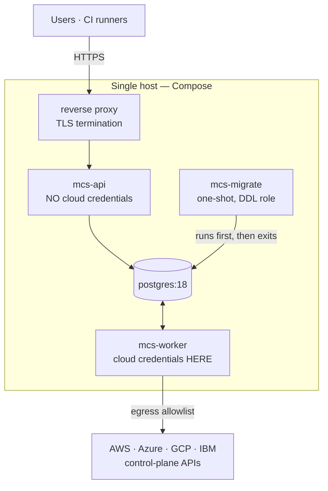

# Deployment

Status: accepted for v0.1.0
Last updated: 2026-08-05

How MultiCloudShield is packaged, configured, run, and upgraded. The packaging decision is
[ADR-0018](decisions/0018-packaging-and-deployment.md).

---

## 1. Topology



Four services plus a one-shot migration job. **The credential placement is the most important line in
this document: cloud credentials go to `mcs-worker` only.** The API asserts at startup that no provider
credential environment variables are present and refuses to run if they are, so a copy-paste mistake
becomes an immediate, loud failure rather than a silent expansion of the attack surface
([security-boundaries.md](security-boundaries.md) §2).

---

## 2. Prerequisites

| Requirement | Version | Note |
| --- | --- | --- |
| Docker Engine + Compose v2 | Current | Primary runtime |
| Podman + Compose provider | Podman 5.8.2, podman-compose 1.6.0 verified | See the [demo workflow](../demo-workflow.md#podman) for the current one-shot migration workaround |
| PostgreSQL | **18** | Provided by Compose. `uuidv7()` is a hard requirement ([ADR-0005](decisions/0005-database-and-orm.md)) |
| Host resources | 2 vCPU, 4 GB RAM, 20 GB disk | Sufficient for demo and small estates |
| Cloud credentials | Optional | **Not needed for demo mode** |

For CI/CD use, none of the above applies — `uv tool install multicloudshield` plus cloud credentials in
the environment is the whole dependency ([ADR-0025](decisions/0025-stateless-local-scan-mode.md)).

---

## 3. Images

One image, three application roles (`mcs-api`, `mcs-worker`, and `alembic`), built multi-stage:

```
stage 1  node:24-slim     build the SPA
stage 2  python:3.13-slim install locked dependencies with uv
stage 3  python:3.13-slim runtime — application, SPA assets, no toolchain
```

Hardening applied per the OWASP Docker Security Cheat Sheet and NIST SP 800-190, and set in the shipped
Compose file so the defaults are the hardened ones:

```yaml
user: "10001:10001"          # non-root, numeric
read_only: true
tmpfs: [/tmp]
cap_drop: [ALL]              # a read-only scanner needs no capabilities
security_opt: ["no-new-privileges:true"]
```

---

## 4. Configuration

Environment-first, validated at startup, process refuses to start on invalid configuration
([ADR-0015](decisions/0015-configuration.md)). Prefix `MCS_`, nested with `__`.

### Shared

| Variable | Default | Notes |
| --- | --- | --- |
| `MCS_ENV` | `production` | `development` relaxes cookie flags for local HTTP only |
| `MCS_DATABASE__URL` | — | Application role: DML only, **no DDL** |
| `MCS_LOG__LEVEL` / `MCS_LOG__FORMAT` | `info` / `json` | |
| `MCS_SECRET_KEY` | — | Required; a default or empty value refuses to start |

### API only

| Variable | Default | Notes |
| --- | --- | --- |
| `MCS_API__PUBLIC_URL` | — | Used for cookie scope and absolute links |
| `MCS_API__CORS_ORIGINS` | *(empty)* | Same-origin by default; wildcard + credentials is refused |
| `MCS_AUTH__SESSION_IDLE_MINUTES` | `30` | |
| `MCS_AUTH__SESSION_ABSOLUTE_HOURS` | `8` | |

### Worker only

| Variable | Default | Notes |
| --- | --- | --- |
| `MCS_SCAN__MAX_CONCURRENT_TARGETS` | `16` | Global |
| `MCS_SCAN__MAX_PER_CONNECTION` | `8` | |
| `MCS_SCAN__MAX_PER_PROVIDER` | `4` | |
| `MCS_SCAN__CALL_TIMEOUT_SECONDS` | `30` | |
| `MCS_SCAN__TARGET_DEADLINE_SECONDS` | `300` | |
| `MCS_SCAN__SCAN_DEADLINE_SECONDS` | `3600` | |
| `MCS_SCAN__MAX_PAGES_PER_TARGET` | `200` | |
| `MCS_SCAN__MAX_ITEMS_PER_TARGET` | `50000` | |
| `MCS_RETENTION__EVIDENCE_DAYS` | `365` | |
| `MCS_RETAIN_RAW_PAYLOADS` | `false` | Debug only; logs a prominent warning at startup |
| `AZURE_TOKEN_CREDENTIALS` | `prod` | **Set in the image.** Stops the credential chain from silently picking up an operator's `az login` identity |

Defaults are deliberately conservative. The failure mode of an aggressive scanner is throttling a
customer's production account, so tuning is expected to go **down** more often than up.

---

## 5. Cloud credentials

**MultiCloudShield never stores a cloud secret** ([ADR-0013](decisions/0013-credential-handling.md)).
Credentials reach the worker through the provider's own chain. Recommended mechanisms, strongest first:

| Provider | Preferred | Acceptable |
| --- | --- | --- |
| AWS | IRSA / instance role + `sts:AssumeRole` with an `ExternalId` supplied by env var name | SSO profile; static keys as a last resort |
| Azure | Workload identity federation, managed identity | Service principal via `EnvironmentCredential` |
| GCP | Workload identity federation, service account impersonation | Key file — **Google's own documentation discourages this** |
| IBM | Trusted profile | IAM API key from an env var |

Connections reference credentials by **environment variable name**, never by value, so rotation is
entirely handled by the operator's existing tooling.

**All connections' credentials live in one worker's environment.** Operators needing separation between
estates should run separate worker containers with separate environments; the per-connection env-var
naming already supports it.

### Least privilege

Per-collector permissions are declared in code and used to generate the role documents, so the
documentation cannot drift from what we call
([provider-coverage-matrix.md](../planning/provider-coverage-matrix.md)).

- **AWS:** the generated minimal policy, or `arn:aws:iam::aws:policy/SecurityAudit` as the convenient
  fallback. **Not `ReadOnlyAccess`** — its `s3:Get*` wildcard includes `s3:GetObject`, your object
  data. **Not `ViewOnlyAccess`** — it lacks `s3:GetBucket*` and `cloudtrail:GetTrailStatus`, so checks
  would silently under-report.
- **Azure:** `Reader` + `Security Reader` at subscription scope. Never storage account keys.
- **GCP:** `roles/cloudasset.viewer` + `roles/iam.securityReviewer`, **plus `roles/viewer`** where
  per-resource configuration is needed — `securityReviewer` grants list and `getIamPolicy`, not `get`.
- **IBM:** both a platform role (Viewer) and service roles (Reader), per service instance.

Run `mcs connection test` after granting: `degraded` tells you exactly which permission is missing.

---

## 6. Network

**Ingress.** Only the reverse proxy is published. TLS is terminated there; the application sets
`Secure` cookies and HSTS accordingly and never terminates TLS itself. Do not expose the API directly.

**Egress.** The worker's only intended destinations are provider control-plane APIs. An egress
allowlist is recommended; the per-provider domain list is published in the setup guides. Blocking
`169.254.0.0/16` and RFC 1918 from the worker is recommended defence in depth
([threat-model.md](threat-model.md) §T4).

The API process needs **no** outbound access. **MultiCloudShield makes no telemetry, update-check, or
notification call of any kind** ([ADR-0016](decisions/0016-observability.md)).

---

## 7. Running it

### Demo — no cloud account

```bash
git clone https://github.com/oborges/MultiCloudShield.git
cd MultiCloudShield
cp .env.example .env            # generate MCS_SECRET_KEY as instructed
docker compose up -d
docker compose run --rm api mcs bootstrap --email you@example.com
docker compose run --rm api mcs demo seed
# open http://localhost:8080 — demo findings for four providers
```

The equivalent verified Podman sequence is documented in the
[deterministic demo workflow](../demo-workflow.md#podman).

### A real cloud account

```bash
# 1. Grant the least-privilege role (see the per-provider guide)
# 2. Put credentials in the WORKER environment only
# 3. Register and verify
mcs connection add --provider aws --scope-id 111122223333 \
    --mechanism aws_assume_role \
    --role-arn arn:aws:iam::111122223333:role/MultiCloudShieldAudit \
    --external-id-env MCS_AWS_EXTERNAL_ID_PROD
mcs connection test --name prod-aws      # ok | degraded (with missing permissions) | failed
mcs scan start --connection prod-aws --wait
```

### CI/CD — no server, no database

```yaml
- run: uv tool install multicloudshield
- run: mcs scan --local --provider aws --scope 111122223333 \
         --output json --out findings.json --fail-on high
```

Exit codes: `0` clean · `2` findings at or above `--fail-on` · `3` scan failed · `4` partial results.

---

## 8. Operations

### Health

| Endpoint | Purpose |
| --- | --- |
| `/healthz` | Liveness. **No database access** — a database outage must not cause a restart loop |
| `/readyz` | Readiness: database connectivity, migration state, queue reachability |

The worker leases and heartbeats jobs in PostgreSQL. Operators monitor its container state and
structured stdout logs; there is no separate worker HTTP health endpoint in v0.1.0.

### Backup

Back up PostgreSQL. It holds findings, evidence, and audit history — **and no cloud credentials**, so a
database backup is sensitive (it is a map of your weaknesses) but is not a credential exposure. Restore
is a standard `pg_restore`; the schema version must match the application version.

### Upgrade

```bash
docker compose pull
docker compose run --rm migrate
docker compose up -d
```

Migrations are **never** run inside API startup. Compose runs the separate one-shot `migrate` service
before API and worker. The local topology currently uses one PostgreSQL role for DDL and DML;
production operators should separate them. `/readyz` returns non-200 while the schema is behind, so
a forgotten migration is visible rather than mysterious.

### Retention

Automated evidence minimization and retention cleanup are not implemented in v0.1.0. Until that
maintenance job lands, operators must include database growth in capacity and backup planning.

---

## 9. What is not supported in v0.1.0

Stated plainly so nobody plans around an assumption:

| Not supported | Path |
| --- | --- |
| **Kubernetes manifests or a Helm chart** | The architecture allows it (stateless API and workers, external PostgreSQL); shipping a chart means supporting it, and there is no evidence of demand yet |
| Published container images | Deferred until release signing and provenance are in place — shipping unsigned images for a security tool sets a bad precedent |
| PostgreSQL 17 or older | PG18's `uuidv7()` is a hard requirement |
| Multiple organizations in one deployment | Single-organization; separate deployments for mutually distrusting parties ([security-boundaries.md](security-boundaries.md) §4) |
| Horizontal API scaling behind a load balancer | Should work (stateless API, database-backed sessions) but is untested in v0.1.0 |
| Multiple workers | Supported by the queue; the default deployment runs one and more is untested |
| Managed PostgreSQL | Should work; connection pooling and queue polling behavior are untested |
| Scheduled scans | Manual trigger only in v0.1.0 |
