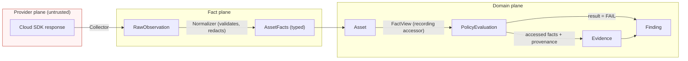
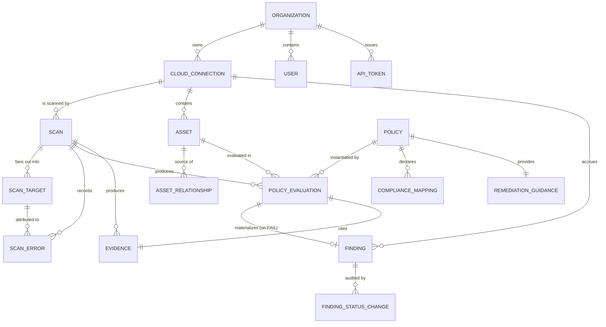
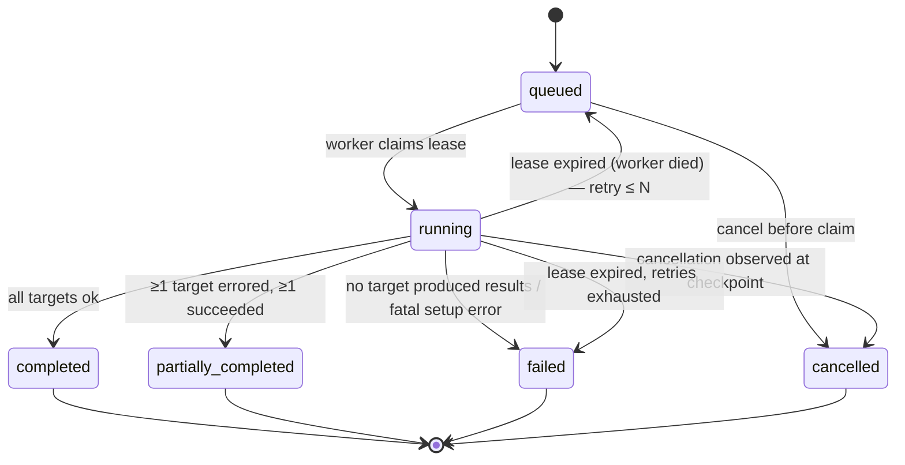
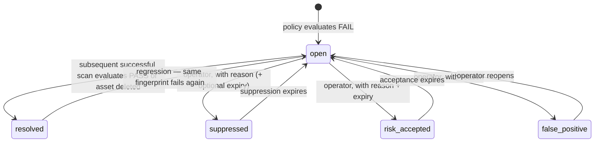

# Domain Model

Status: accepted for v0.1.0
Last updated: 2026-08-05

This document defines the normalized domain of MultiCloudShield. It is the contract that
provider adapters, the policy engine, the persistence layer, and the API all agree on.

The central rule: **no provider-specific type, SDK object, or vocabulary crosses into the core
domain.** Adapters translate; the core never adapts.

---

## 1. Layer separation

MultiCloudShield has three data planes. Confusing them is the primary architectural failure mode
this design guards against.

| Plane | Contents | Lifetime | Persisted |
| --- | --- | --- | --- |
| **Provider plane** | Raw SDK responses (`dict` from boto3, `StorageAccount` from Azure SDK, protobufs from GCP) | In-memory, within one collector call | No (see §9) |
| **Fact plane** | `RawObservation` → normalized, typed `AssetFacts` | Duration of a scan | Yes, as `Asset.facts` |
| **Domain plane** | `Asset`, `Finding`, `Evidence`, `Scan`, … | Indefinite | Yes |



**Trust rule:** everything in the provider plane is untrusted input. Normalizers are the
validation boundary (see [threat-model.md](threat-model.md) §T9).

---

## 2. Entity–relationship overview



`CloudProvider`, `Severity`, and `FindingStatus` are enumerations, not tables (§10).

---

## 3. Connection and tenancy entities

### Organization

The tenancy seam. v0.1.0 ships with exactly one row, created at bootstrap. Every tenant-scoped
table carries `organization_id` and every read goes through a repository that requires an
`OrgScope`. This costs almost nothing now and is the difference between "add multi-tenancy later"
and "rewrite later".

| Field | Type | Notes |
| --- | --- | --- |
| `id` | UUID | |
| `slug` | text, unique | |
| `name` | text | |
| `created_at` | timestamptz | |

See [security-boundaries.md](security-boundaries.md) §4 for exactly what is and is not isolated.

### CloudConnection

A reference to a cloud scope the operator asserts they are authorized to assess.

| Field | Type | Notes |
| --- | --- | --- |
| `id` | UUID | |
| `organization_id` | UUID FK | |
| `name` | text | unique per org; human label |
| `provider` | enum `CloudProvider` | `aws` \| `azure` \| `gcp` \| `ibm` \| `demo` |
| `scope_type` | enum | `aws_account`, `azure_subscription`, `gcp_project`, `ibm_account`, `demo_estate` |
| `scope_id` | text | account ID / subscription GUID / project ID / IBM account ID |
| `credential_mechanism` | enum `CredentialMechanism` | §3.1 — *what mechanism*, never a value |
| `credential_reference` | JSONB | non-secret pointers only; see §3.2 |
| `region_allowlist` | text[] | empty = provider default set, never "all discovered" |
| `enabled` | boolean | disabled connections are skipped by scans and clearly marked in UI |
| `is_demo` | boolean | derived from provider, denormalized for cheap filtering |
| `last_verified_at` | timestamptz null | set by connectivity test |
| `last_verification_status` | enum | `never_tested`, `ok`, `degraded`, `failed` |
| `last_verification_detail` | JSONB | redacted, structured; permission gaps listed per collector |
| `created_at` / `updated_at` / `created_by` | | |

`degraded` is a first-class outcome: the credential authenticates but lacks permissions for a
subset of collectors. The UI must show *which* collectors will be skipped, not a binary pass/fail.

#### 3.1 CredentialMechanism

Recorded so an operator can audit *how* access is obtained without the system ever seeing a secret.

```
aws_default_chain          aws_assume_role           aws_sso_profile
azure_default_credential   azure_workload_identity   azure_managed_identity
gcp_adc                    gcp_impersonation         gcp_workload_identity
ibm_api_key_env            ibm_trusted_profile
demo_none
```

#### 3.2 credential_reference — the no-secrets rule

`credential_reference` may only contain **non-secret pointers**. Permitted keys per mechanism are
enumerated in a schema and validated on write; anything else is rejected with `422`.

```jsonc
// aws_assume_role — permitted
{ "role_arn": "arn:aws:iam::111122223333:role/MultiCloudShieldAudit",
  "external_id_env": "MCS_AWS_EXTERNAL_ID_PROD",   // the NAME of an env var
  "session_name": "multicloudshield" }

// REJECTED at the API boundary
{ "aws_secret_access_key": "…", "external_id": "literal-value" }
```

Enforcement is three-layered, because a single check will eventually be bypassed:

1. **Schema allowlist** per mechanism (keys, types, regex) — rejects unknown keys.
2. **Entropy + pattern screen** on all string values — rejects anything matching known credential
   shapes or exceeding an entropy threshold, with the offending value never echoed back.
3. **No read-back** — the API never returns `credential_reference` values that were flagged, and
   the column is excluded from exports.

`external_id` is treated as secret-adjacent and is therefore accepted **only** as an env var name.

### User and ApiToken

| Entity | Key fields |
| --- | --- |
| `User` | `id`, `organization_id`, `email`, `password_hash` (Argon2id), `role`, `is_active`, `last_login_at`, `failed_login_count`, `locked_until` |
| `ApiToken` | `id`, `organization_id`, `name`, `token_prefix` (public lookup key), `token_hash` (SHA-256 of the full secret), `role`, `expires_at`, `last_used_at`, `revoked_at`, `created_by` |

Roles: `owner`, `analyst`, `viewer` — see [ADR-0012](decisions/0012-authorization-model.md).

---

## 4. Scan entities

### Scan

| Field | Type | Notes |
| --- | --- | --- |
| `id` | UUID | |
| `organization_id`, `connection_id` | UUID FK | |
| `status` | enum `ScanStatus` | §4.1 |
| `trigger` | enum | `manual_api`, `manual_cli`, `manual_ui` (v0.1.0); `scheduled`, `webhook` reserved |
| `requested_by_user_id` / `requested_by_token_id` | UUID null | exactly one is set |
| `idempotency_key` | text null | unique per `(connection_id, key)`; replays return the existing scan |
| `queued_at`, `started_at`, `finished_at` | timestamptz | |
| `cancellation_requested_at` | timestamptz null | cooperative cancellation flag |
| `policy_bundle_version` | text | pinned at scan start — reproducibility |
| `engine_version` | text | product version that produced the results |
| `collector_set_digest` | text | sha256 over the enabled collector IDs + versions |
| `stats` | JSONB | §4.2 |
| `is_demo` | boolean | |

`policy_bundle_version` + `engine_version` + `collector_set_digest` are what make a finding
*reproducible*: re-running the same policy bundle against the same stored facts must produce
byte-identical evaluations.

#### 4.1 ScanStatus lifecycle



- `partially_completed` is a **success** state for reporting purposes and must be visually distinct
  in the UI. Treating partial failure as total failure is the behaviour that makes CSPM tools
  untrustworthy; treating it as full success is the behaviour that makes them dangerous.
- Cancellation is **cooperative**: the worker checks `cancellation_requested_at` between scan
  targets and between pagination pages. In-flight HTTP calls are allowed to finish or time out.
  The API documents cancellation as best-effort with a bounded delay.
- Lease expiry → requeue is the at-least-once guarantee. Scan steps are idempotent (§4.3) so a
  replay is safe.

#### 4.2 Scan.stats shape

```jsonc
{
  "targets": { "total": 34, "succeeded": 31, "failed": 2, "skipped": 1 },
  "assets": { "discovered": 412, "new": 12, "changed": 5, "unchanged": 395 },
  "api_calls": { "total": 288, "throttled": 4, "retried": 7 },
  "policies": { "evaluated": 26, "pass": 380, "fail": 41, "not_applicable": 90,
                "insufficient_data": 6, "error": 0 },
  "findings": { "critical": 2, "high": 9, "medium": 21, "low": 8, "informational": 1,
                "new": 3, "resolved": 4 },
  "duration_ms": 41230
}
```

`insufficient_data` being non-zero is a signal the UI surfaces prominently — it means permissions
or API failures prevented a verdict. It must never be silently folded into `pass`.

#### 4.3 Idempotency

Idempotency is defined per scan step, not per scan:

- **Asset upsert** is keyed on `asset_urn` (§5.1) → replay updates `last_seen_*`, never duplicates.
- **PolicyEvaluation** is keyed on `(scan_id, policy_id, asset_id, sub_locator)` → unique index;
  replay is an upsert.
- **Finding** is keyed on `fingerprint` (§6.1) → replay updates `last_seen_*`, preserves
  `first_seen_*` and any human-set status.
- **Scan creation** honours `Idempotency-Key`, so a retried API/CLI call does not start a second scan.

### ScanTarget

The unit of fan-out, concurrency, and partial failure. One row per `(scope, collector)` pair.

| Field | Type | Notes |
| --- | --- | --- |
| `id`, `scan_id` | UUID | |
| `scope_kind` | enum | `global`, `region`, `location`, `zone`, `resource_group` |
| `scope_id` | text | e.g. `eu-west-1`, `global`, `westeurope` |
| `collector_id` | text | e.g. `aws.s3.buckets` |
| `collector_version` | text | |
| `status` | enum | `pending`, `running`, `succeeded`, `failed`, `skipped`, `cancelled` |
| `skip_reason` | enum null | `permission_denied`, `api_not_enabled`, `region_opted_out`, `unsupported`, `disabled_by_config` |
| `started_at`, `finished_at` | timestamptz | |
| `items_collected`, `pages_fetched`, `api_calls`, `error_count` | int | |

`skip_reason = api_not_enabled` (GCP service APIs, IBM services not provisioned) is normal, not an
error, and is reported as informational rather than as a failure.

### ScanError

| Field | Type | Notes |
| --- | --- | --- |
| `id`, `scan_id`, `scan_target_id` | UUID | target may be null for scan-level errors |
| `category` | enum `ScanErrorCategory` | below |
| `provider`, `scope_id`, `collector_id`, `operation` | text | `operation` = SDK call name |
| `message` | text | **redacted**, normalized, no raw provider payload |
| `provider_error_code` | text null | e.g. `AccessDenied`, `AuthorizationFailed` |
| `retryable`, `retry_count` | boolean, int | |
| `remediation_hint` | text null | e.g. the exact missing permission |
| `occurred_at` | timestamptz | |

```
ScanErrorCategory:
  authentication      credential chain produced nothing / expired
  permission_denied   authenticated but not authorized  ← drives the actionable hint
  throttled           rate limited after retry budget exhausted
  timeout             per-call or per-target deadline exceeded
  not_found           scope disappeared mid-scan
  service_disabled    API/service not enabled for this scope
  unsupported_region  region not opted-in / service unavailable there
  api_error           provider returned an unexpected error
  parse_error         response failed normalization/validation ← treat as suspicious
  internal            defect in MultiCloudShield
```

`permission_denied` errors carry the specific IAM action so the UI can render "grant
`s3:GetBucketPolicyStatus` to complete this check" instead of a stack trace.

---

## 5. Asset entities

### Asset

| Field | Type | Notes |
| --- | --- | --- |
| `id` | UUID | surrogate |
| `organization_id`, `connection_id` | UUID FK | |
| `asset_urn` | text, unique per org | §5.1 — the stable identity |
| `native_id` | text | ARN / Azure resource ID / GCP full resource name / IBM CRN |
| `resource_type` | enum `NormalizedResourceType` | §5.2 — the cross-provider taxonomy |
| `provider_resource_type` | text | e.g. `Microsoft.Storage/storageAccounts` — kept for evidence and filtering, never for policy dispatch |
| `name` | text | |
| `scope_kind`, `scope_id` | | region/location/global |
| `tags` | JSONB | normalized `{key: value}`; keys lowercased, values never parsed |
| `facts` | JSONB | typed normalized facts, §5.3 |
| `facts_digest` | text | sha256 over canonical JSON of `facts` — change detection |
| `first_seen_at`, `last_seen_at` | timestamptz | |
| `first_seen_scan_id`, `last_seen_scan_id` | UUID | |
| `deleted_at` | timestamptz null | set when absent from a *successful* full collection of its type |

Absence-based deletion is only applied when the owning `ScanTarget` **succeeded**. A permission
error must never be interpreted as "the resource is gone" — that would silently resolve findings.

#### 5.1 asset_urn — canonical identity

```
mcs:{provider}:{scope_id}:{resource_type}:{provider_local_id}
```

Examples:

```
mcs:aws:111122223333:object_storage.bucket:my-logs-bucket
mcs:azure:8a1f…-guid:object_storage.account:rg-prod/stprodlogs
mcs:gcp:acme-prod-1234:object_storage.bucket:acme-artifacts
mcs:ibm:a1b2…:object_storage.bucket:acme-cos/backups
```

Rules: lowercase provider; `provider_local_id` is the smallest provider-stable identifier
(never a display name that users can change, never an IP, never a mutable tag). Building the URN
is the adapter's job and is covered by adapter conformance tests.

#### 5.2 NormalizedResourceType

Deliberately small in v0.1.0 — one entry per area we actually collect. A taxonomy grows badly if
it is speculative.

```
object_storage.bucket          object_storage.account
network.firewall_ruleset       network.firewall_rule
identity.principal             identity.policy_binding
logging.audit_trail            logging.diagnostic_setting
kms.key                        kms.vault
account.scope
```

`account.scope` is a synthetic asset representing the account/subscription/project itself, so that
account-level policies (e.g. "audit logging enabled for the account") have a real asset to attach
a finding to, rather than a dangling scope reference.

#### 5.3 AssetFacts — the typed fact schema

Each `NormalizedResourceType` has a versioned Pydantic model. Facts are the **only** input a policy
may read.

```python
class ObjectStorageBucketFacts(BaseModel):
    schema_version: Literal[1] = 1

    # Cross-provider normalized facts — every adapter must populate or explicitly mark unknown.
    public_read_access: TriState          # yes | no | unknown
    public_write_access: TriState
    encryption_at_rest: EncryptionPosture # none | provider_managed | customer_managed | unknown
    encryption_key_urn: str | None
    versioning_enabled: TriState
    access_logging_enabled: TriState
    tls_required: TriState                # bucket policy / secure-transfer enforcement

    # Controlled escape hatch — see §5.4
    provider_specific: ProviderSpecificFacts = ProviderSpecificFacts()
```

**`TriState` is mandatory, not a convenience.** A boolean cannot express "we could not read this",
and a policy that treats unknown as `False` produces false negatives (silent risk) while treating
it as `True` produces false positives (alert fatigue). `unknown` forces the evaluation to return
`INSUFFICIENT_DATA`, which surfaces the permission gap instead of guessing. This is the single most
important modelling decision in the fact plane.

#### 5.4 provider_specific — the controlled escape hatch

Symmetry must not be faked. When a provider has a concept with no cross-provider analogue
(S3 Block Public Access, Azure `allowSharedKeyAccess`, GCP uniform bucket-level access), it lives
in a namespaced, typed sub-model:

```python
facts.provider_specific.aws.s3.block_public_access_all   # TriState
facts.provider_specific.gcp.storage.uniform_bucket_level_access
facts.provider_specific.azure.storage.allow_shared_key_access
```

A policy that reads any `provider_specific` path **must** declare it in `requires_facts` and
**must** declare narrowed `provider_applicability`. The loader rejects a policy that reads a
provider-specific fact while claiming to apply to all providers. This keeps the escape hatch
explicit and auditable rather than a leak.

### AssetRelationship

| Field | Notes |
| --- | --- |
| `source_asset_id`, `target_asset_id` | UUID FK |
| `relationship_type` | `contains`, `attached_to`, `encrypted_by`, `logs_to`, `grants_access_to`, `member_of` |
| `discovered_by_scan_id` | UUID |
| `confidence` | `asserted` (provider states it) \| `inferred` (we derived it) |

Used in v0.1.0 for: firewall ruleset → attached compute/subnet, bucket → KMS key, audit trail →
destination bucket. Relationships are additive context; **no v0.1.0 policy depends on a relationship
being present**, so a missing relationship degrades explanation quality, never correctness.

---

## 6. Finding entities

### Finding

| Field | Type | Notes |
| --- | --- | --- |
| `id` | UUID | |
| `organization_id`, `connection_id`, `asset_id` | UUID FK | |
| `fingerprint` | text, unique per org | §6.1 |
| `policy_id`, `policy_version` | text | |
| `title`, `risk_explanation`, `remediation_snapshot` | text/JSONB | **denormalized at creation** |
| `severity` | enum `Severity` | effective severity |
| `severity_source` | enum | `policy_default` \| `context_adjusted` \| `operator_override` |
| `status` | enum `FindingStatus` | §6.2 |
| `evidence_id` | UUID FK | |
| `first_seen_at`, `first_seen_scan_id` | | never mutated after creation |
| `last_seen_at`, `last_seen_scan_id` | | |
| `resolved_at`, `resolution_scan_id` | | |
| `suppressed_reason`, `suppressed_by`, `suppressed_until` | | |

**Why denormalize the policy text into the finding:** a finding is a historical statement about a
point in time. If policy `MCS-AWS-S3-001` is later reworded or re-scored, a six-month-old finding
must still read the way it read when it was raised. The live catalog is joined for *current*
context; the snapshot is what gets exported and audited.

#### 6.1 fingerprint

```
sha256(organization_id ‖ connection_id ‖ policy_id ‖ asset_urn ‖ sub_locator)
```

`sub_locator` distinguishes multiple findings of the same policy on one asset — e.g. two offending
rules in one security group: `rule/sgr-0a1b2c3d`. It is empty for asset-level policies.

The fingerprint deliberately **excludes** `policy_version`, severity, and any fact value. A
reworded policy or a severity re-score must not orphan an existing finding and resurrect it as
"new" — that destroys the finding lifecycle and the operator's triage history.

#### 6.2 FindingStatus



Transition rules:

- Only `open ↔ resolved` are machine-driven. Everything else requires a human actor and a reason.
- **A scan never overwrites a human decision.** If a `risk_accepted` finding still fails, the scan
  updates `last_seen_at` and leaves the status alone.
- `resolved` requires a **successful** evaluation, not merely the absence of a failure. A finding
  whose asset could not be re-read this scan stays `open` and is flagged `stale` in the UI
  (derived: `last_seen_scan_id != connection.latest_successful_scan_id`).
- Every transition writes a `FindingStatusChange` row (`from`, `to`, `actor`, `reason`, `at`).
  Unreasoned suppression is the mechanism by which security tools get quietly neutered; the audit
  trail is the countermeasure.

#### 6.3 Severity and the rubric

```
critical  high  medium  low  informational
```

An enum without a rubric produces inconsistent policies across contributors. Severity is assigned
from a two-axis table, and every policy must record which cell it claims:

| | Exploitable without credentials | Requires existing access | Weakens defence only |
| --- | --- | --- | --- |
| **Data exposure / full control** | critical | high | medium |
| **Privilege escalation path** | high | high | medium |
| **Loss of detection / audit** | high | medium | low |
| **Hardening gap** | medium | low | informational |

Context adjustment in v0.1.0 is limited to **one** rule, to keep findings deterministic: a policy
may declare `severity_escalation_when` referencing facts already in its `requires_facts` set
(e.g. bucket is public **and** contains an object-lock/compliance tag → escalate one level). The
adjustment must be a pure function of facts, and `severity_source` records that it fired.

### Evidence

Immutable. One row per `PolicyEvaluation` that produced a verdict.

| Field | Type | Notes |
| --- | --- | --- |
| `id`, `scan_id` | UUID | |
| `collected_at` | timestamptz | when the *facts* were collected, not when evaluated |
| `observed_facts` | JSONB | exactly the facts the policy read — captured automatically, §6.4 |
| `provenance` | JSONB | list of API calls that produced those facts, §6.5 |
| `content_digest` | text | sha256 over canonical JSON of `observed_facts` + `provenance` |
| `redaction_applied` | boolean | |
| `retention_class` | enum | `standard` \| `minimized` |

#### 6.4 Evidence is captured, not authored

Policies read facts through a `FactView` that records every attribute access. Evidence is therefore
**derived from execution**, not hand-written by the policy author.

```python
def evaluate(facts: FactView[ObjectStorageBucketFacts]) -> Verdict:
    if facts.public_read_access is TriState.UNKNOWN:
        return Verdict.insufficient_data("Bucket ACL/policy not readable")
    if facts.public_read_access is TriState.YES:
        return Verdict.fail()
    return Verdict.pass_()
```

The recorded evidence for a FAIL is `{"public_read_access": "yes"}` — precisely the facts consulted,
no more. This gives three properties for free:

1. Evidence can never drift from the logic, because it *is* the logic's input trace.
2. Evidence is minimal by construction — we do not dump whole resource payloads into the database.
3. `requires_facts` can be **verified against actual access** in tests; a policy that reads an
   undeclared fact fails its conformance test.

#### 6.5 provenance

```jsonc
{
  "collector_id": "aws.s3.buckets",
  "collector_version": "1.0.0",
  "calls": [
    { "service": "s3", "operation": "GetPublicAccessBlock", "scope": "us-east-1",
      "request": { "Bucket": "my-logs-bucket" },      // parameters only, allowlisted keys
      "response_digest": "sha256:9f2c…", "at": "2026-08-05T10:14:02Z", "http_status": 200 }
  ],
  "engine_version": "0.1.0",
  "policy_bundle_version": "2026.08.1"
}
```

`response_digest` rather than the response body: enough to prove *which* response the verdict came
from and to detect drift, without warehousing customer cloud metadata (see §9).

---

## 7. Policy entities

`Policy`, `RemediationGuidance`, and `ComplianceMapping` are authored in the policy bundle (files in
version control) and **projected into the database** on load, so findings can reference them by FK
and historical catalogs remain queryable. The files are the source of truth; the tables are a cache
keyed by `(policy_id, policy_version)`.

### Policy

| Field | Notes |
| --- | --- |
| `id` | stable slug, e.g. `MCS-STOR-001`, `MCS-AWS-IAM-004` — never renumbered |
| `version` | semver of this policy's logic/text |
| `title`, `description`, `rationale` | original prose (§8) |
| `default_severity` + `severity_rubric_cell` | §6.3 |
| `provider_applicability` | `["aws","azure","gcp","ibm"]` or a subset |
| `resource_type_applicability` | list of `NormalizedResourceType` |
| `requires_facts` | list of fact paths — enforced against runtime access |
| `origin` | `mcs_best_practice` \| `external_control_derived` (§8) |
| `references` | `[{title, url, accessed_on}]` |
| `enabled_by_default` | boolean |
| `bundle_version` | the bundle that supplied this row |

### RemediationGuidance

```jsonc
{
  "summary": "Block public read access on the bucket.",
  "steps": ["…human-readable, provider-console-oriented…"],
  "required_permissions": ["s3:PutPublicAccessBlock"],
  "snippets": [
    { "kind": "cli", "language": "bash", "content": "aws s3api put-public-access-block …",
      "review_required": true }
  ],
  "verification": "Re-run the scan; the finding should move to resolved.",
  "change_risk": "medium",
  "change_risk_note": "May break intentionally public static-website buckets."
}
```

**v0.1.0 never executes a snippet.** Snippets are rendered as text with an explicit copy action and
a `review_required` banner. There is no code path in the product that can invoke a cloud write —
this is enforced structurally by the adapter contract, not by convention
(see [provider-adapters.md](provider-adapters.md) §6).

### ComplianceMapping

| Field | Notes |
| --- | --- |
| `framework` | e.g. `CIS_AWS_FOUNDATIONS`, `NIST_800_53`, `ISO_27001` |
| `framework_version` | e.g. `5.0`, `Rev.5`, `2022` |
| `control_id` | identifier only — e.g. `2.1.5`, `SC-13`, `A.8.24` |
| `relationship` | `supports` \| `partially_supports` |
| `note` | our own words on how/why it maps |

**No control text from any external framework is stored or displayed.** We store the identifier and
write our own note. See §8 and [ADR-0024](decisions/0024-compliance-mapping-policy.md).

### PolicyEvaluation

| Field | Notes |
| --- | --- |
| `id`, `scan_id`, `policy_id`, `policy_version` | |
| `asset_id` | null only for scope-level evaluations where no `account.scope` asset exists |
| `sub_locator` | text, default `""` |
| `result` | `pass` \| `fail` \| `not_applicable` \| `insufficient_data` \| `error` |
| `reason_code` | short machine code, e.g. `PUBLIC_READ_ALLOWED`, `ACL_UNREADABLE` |
| `evidence_id` | FK |
| `duration_ms`, `evaluated_at` | |

Unique on `(scan_id, policy_id, asset_id, sub_locator)`.

The five-valued result is deliberate. `not_applicable` (policy doesn't apply to this asset) and
`insufficient_data` (policy applies but facts are unknown) are different situations with different
operator responses, and collapsing them hides permission gaps.

---

## 8. Original content and compliance identifiers

Two rules, applied by review and by a CI check:

1. **All prose we ship is ours.** Titles, descriptions, rationales, and remediation guidance are
   written for MultiCloudShield. No benchmark, standard, or vendor text is copied.
2. **Identifiers are references, not content.** `ComplianceMapping` stores `framework +
   version + control_id` and our own note. The UI renders `CIS AWS Foundations 5.0 — 2.1.5` as a
   label, optionally hyperlinked to the publisher, with no control text.

`Policy.origin` records the provenance of the *idea*:

- `mcs_best_practice` — we decided this check is valuable; mappings (if any) are advisory.
- `external_control_derived` — the check exists because an external control expects it; the mapping
  is the point.

Conflating the two is how open-source tools end up implying certification they cannot provide. The
UI labels them differently and the compliance report states plainly that mappings are our
interpretation and are not an audit.

---

## 9. Data minimization

What we persist, and why:

| Data | Persisted | Rationale |
| --- | --- | --- |
| Normalized `facts` | Yes | Required for evaluation, evidence, and reproducibility |
| Raw provider payloads | **No** (default) | Contain unnecessary metadata; enabling `MCS_RETAIN_RAW_PAYLOADS=true` is a debug-only, per-connection, time-bounded option that logs a warning at startup |
| Response digests | Yes | Provenance without the payload |
| Resource contents (objects, secret values, DB rows) | **Never collected** | Out of scope by design; no collector may read data-plane content |
| Tags/labels | Yes, values not parsed | Frequently contain owner emails → treated as personal data, redactable on export |
| Principal identifiers (user ARNs, emails, service accounts) | Yes, pseudonymizable | Needed for IAM findings; `MCS_PSEUDONYMIZE_PRINCIPALS` hashes them in exports |
| IP addresses in firewall rules | Yes | They *are* the finding |

The schema reserves `retention_class` for future lifecycle enforcement. Automated evidence
minimization and deletion are not implemented in v0.1.0; operators must manage database retention at
the deployment level until the maintenance job lands.

---

## 10. Enumerations summary

| Enum | Values |
| --- | --- |
| `CloudProvider` | `aws`, `azure`, `gcp`, `ibm`, `demo` |
| `CredentialMechanism` | §3.1 |
| `ScanStatus` | `queued`, `running`, `completed`, `partially_completed`, `failed`, `cancelled` |
| `ScanTargetStatus` | `pending`, `running`, `succeeded`, `failed`, `skipped`, `cancelled` |
| `ScanErrorCategory` | §4, ScanError |
| `NormalizedResourceType` | §5.2 |
| `TriState` | `yes`, `no`, `unknown` |
| `EncryptionPosture` | `none`, `provider_managed`, `customer_managed`, `unknown` |
| `Severity` | `critical`, `high`, `medium`, `low`, `informational` |
| `FindingStatus` | `open`, `resolved`, `suppressed`, `risk_accepted`, `false_positive` |
| `EvaluationResult` | `pass`, `fail`, `not_applicable`, `insufficient_data`, `error` |
| `PolicyOrigin` | `mcs_best_practice`, `external_control_derived` |

Enums are stored as **text with a check constraint**, not native PostgreSQL enums — adding a value
to a native enum requires a migration that cannot run inside a transaction with other DDL on some
versions, and enum removal is worse. Text + constraint keeps migrations boring.

---

## 11. Determinism contract

> Given the same `facts`, the same `policy_bundle_version`, and the same `engine_version`, policy
> evaluation MUST produce identical `result`, `reason_code`, `severity`, and `observed_facts`.

Enforced by construction:

- Evaluation functions are pure: no network, no clock, no filesystem, no randomness, no environment
  reads. A lint rule bans those imports inside the policy package.
- Iteration over collections is sorted before evaluation, so multi-item verdicts are order-stable.
- Severity adjustment is a declared pure function of declared facts.
- `Evidence.content_digest` is computed over canonical JSON (sorted keys, no insignificant
  whitespace, RFC 3339 UTC timestamps) so digests are comparable across machines.
- A CI job replays a frozen fact corpus and diffs evaluations against a committed golden file;
  any nondeterminism fails the build (see [testing-strategy.md](testing-strategy.md) §5).

Collection is **not** deterministic — the cloud changes. The contract applies from facts onward,
which is exactly the boundary at which reproducibility is meaningful.
