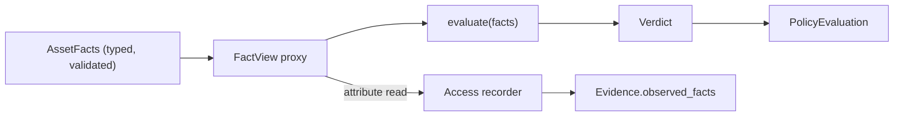
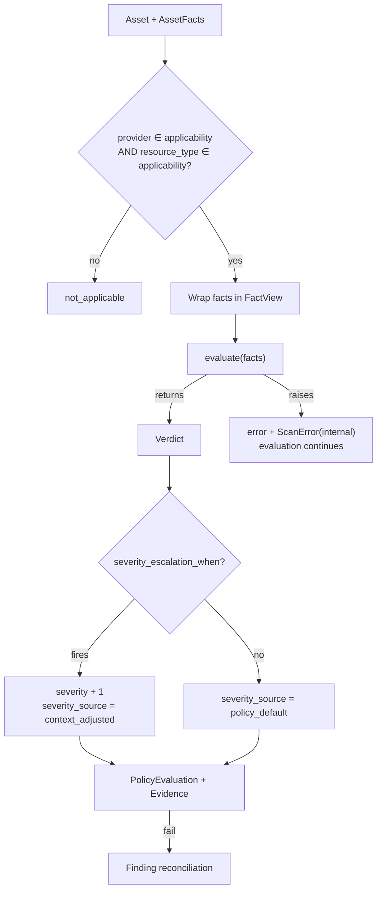

# Policy Engine

Status: accepted for v0.1.0
Last updated: 2026-08-05

How a policy is written, loaded, dispatched, evaluated, and turned into a finding. The representation
decision and its rejected alternatives are [ADR-0009](decisions/0009-policy-representation.md); the
determinism and evidence contract is [ADR-0010](decisions/0010-determinism-and-evidence.md).

---

## 1. Anatomy of a policy

One directory per policy: declarative metadata, a pure evaluation function, fixtures, tests.

```
policy/bundle/storage/public_read/
    policy.yaml
    evaluate.py
    fixtures/
        pass.yaml
        fail_public_acl.yaml
        insufficient_data_unreadable.yaml
        not_applicable_wrong_type.yaml
    test_policy.py
```

### policy.yaml

```yaml
id: MCS-STOR-001
version: 1.0.0
title: Object storage allows public read access
description: >
  The storage bucket or container permits read access to anonymous or all-authenticated
  principals, so its contents can be retrieved by anyone who knows or can guess its name.
rationale: >
  Publicly readable storage is the most common cause of large-scale cloud data exposure.
  Exposure requires no credentials and no exploitation, and enumeration of bucket names is
  routine. Access is rarely logged in a way that reveals what was taken.

severity: critical
severity_rubric_cell: data_exposure/exploitable_without_credentials   # domain-model.md §6.3

provider_applicability: [aws, azure, gcp, ibm, demo]
resource_type_applicability: [object_storage.bucket]

requires_facts:
  - public_read_access

origin: mcs_best_practice

remediation:
  summary: Remove public read grants and enable the provider's account-level public access block.
  steps:
    - Identify why the bucket is public. Static website hosting and public distribution are
      legitimate uses; confirm the intent before changing anything.
    - Remove anonymous and all-authenticated-users grants from the ACL and the resource policy.
    - Enable the provider's account- or project-level control that prevents public access.
    - Re-run a scan to confirm the finding resolves.
  required_permissions:
    aws: [s3:PutPublicAccessBlock, s3:PutBucketAcl, s3:PutBucketPolicy]
    gcp: [storage.buckets.update, storage.buckets.setIamPolicy]
  change_risk: medium
  change_risk_note: >
    Will break intentionally public content such as static websites or public datasets.
    Verify intent before applying.
  verification: Re-run the scan; the finding should move to resolved.

compliance_mappings:
  - { framework: CIS_AWS_FOUNDATIONS, framework_version: "7.0.0", control_id: "2.1.5",
      relationship: supports,
      note: "Relates to the benchmark's expectation that buckets deny public access." }
  - { framework: NIST_800_53, framework_version: "Rev.5", control_id: "AC-3",
      relationship: partially_supports,
      note: "Contributes evidence of access enforcement for stored data." }

references:
  - { title: "Amazon S3 Block Public Access",
      url: "https://docs.aws.amazon.com/AmazonS3/latest/userguide/access-control-block-public-access.html",
      accessed_on: "2026-08-05" }
```

**All prose is ours.** Compliance mappings carry identifiers and our own note, never external control
text ([ADR-0024](decisions/0024-compliance-mapping-policy.md)).

### evaluate.py

```python
from multicloudshield.facts import FactView, ObjectStorageBucketFacts, TriState
from multicloudshield.policy import Verdict


def evaluate(facts: FactView[ObjectStorageBucketFacts]) -> Verdict:
    if facts.public_read_access is TriState.UNKNOWN:
        return Verdict.insufficient_data("BUCKET_ACL_UNREADABLE")
    if facts.public_read_access is TriState.YES:
        return Verdict.fail("PUBLIC_READ_ALLOWED")
    return Verdict.pass_()
```

The signature is exactly `(FactView) -> Verdict`. There is no session, no client, no config, no clock
— **nothing else to reach for**, which is why purity is achievable rather than merely requested.

A more representative policy, using helper predicates so the common case stays short:

```python
def evaluate(facts: FactView[FirewallRulesetFacts]) -> Verdict:
    if facts.rules is Unknown:
        return Verdict.insufficient_data("RULES_UNREADABLE")

    offenders = [
        rule for rule in sorted(facts.rules, key=lambda r: r.rule_id)   # sorted → order-stable
        if rule.direction is Direction.INBOUND
        and is_internet_routable(rule.source)
        and port_range_intersects(rule.ports, ADMINISTRATIVE_PORTS)
    ]
    if not offenders:
        return Verdict.pass_()
    return Verdict.fail(
        "UNRESTRICTED_ADMIN_INGRESS",
        sub_locators=[f"rule/{r.rule_id}" for r in offenders],
    )
```

`sub_locators` produces one finding per offending rule, each with its own stable fingerprint, so
resolving one rule resolves one finding ([domain-model.md](domain-model.md) §6.1).

---

## 2. The FactView

Policies never touch an `Asset`, a database row, or a provider payload. They receive a `FactView` —
a typed proxy over `AssetFacts` that **records every attribute access**.



This buys four things at once:

1. **Evidence is the input trace**, so it can never drift from the logic and is minimal by
   construction ([ADR-0010](decisions/0010-determinism-and-evidence.md)).
2. **`requires_facts` is verifiable** — a conformance test compares declared facts against actual
   access and fails on undeclared reads.
3. **Provider-specific access is auditable**: reading
   `facts.provider_specific.aws.s3.block_public_access_all` is visible in the recorded access set, and
   the loader rejects a policy that reads one while claiming all-provider applicability.
4. **Unknown handling is unavoidable**, because `TriState` has no truthy shortcut — `if
   facts.public_read_access:` does not compile past mypy in strict mode.

---

## 3. Verdicts and the five-valued result

```python
Verdict.pass_()
Verdict.fail(reason_code, sub_locators=None, detail=None)
Verdict.not_applicable(reason_code)
Verdict.insufficient_data(reason_code)
# `error` is produced by the engine when evaluate() raises — never returned by a policy
```

| Result | Meaning | Operator action |
| --- | --- | --- |
| `pass` | Policy applies; the configuration is acceptable | None |
| `fail` | Policy applies; the configuration is not acceptable | Remediate |
| `not_applicable` | Policy does not apply to this asset | None |
| `insufficient_data` | Policy applies, but a required fact is `unknown` | **Grant the missing permission** |
| `error` | The policy raised | File a bug |

`not_applicable` and `insufficient_data` are different situations with different responses, and
collapsing them is how permission gaps become invisible. `insufficient_data` counts are surfaced
prominently on the scan and overview views, never folded into `pass`.

---

## 4. Bundle loading and validation

At startup the loader scans the bundle directory, parses each `policy.yaml`, imports `evaluate.py`,
and **validates before anything can run**:

- Metadata schema conformance; unknown keys rejected.
- Unique `id`; `version` is valid SemVer.
- Every `requires_facts` path exists on the declared fact schemas.
- Every `resource_type_applicability` entry is a real `NormalizedResourceType`.
- **A policy reading `provider_specific.<p>.*` must narrow `provider_applicability` to `<p>`.**
- `severity` matches a valid `severity_rubric_cell`.
- `origin` is set; compliance mappings carry framework, version, control ID, relationship, and note.
- `evaluate` has the exact expected signature.
- No banned import appears in the module (network, filesystem, clock, environment, randomness).

A malformed policy **fails startup**, not a scan. Then the bundle is projected into the database keyed
on `(policy_id, policy_version)` so findings can reference it by foreign key and historical catalogs
stay queryable. Files remain the source of truth; the table is a cache.

`policy_bundle_version` (`YYYY.MM.N`) is pinned into every `Scan`
([ADR-0020](decisions/0020-versioning.md)).

---

## 5. Dispatch and execution



- Dispatch is on **normalized** `resource_type`, never `provider_resource_type`.
- A raising policy produces `error` **for that asset only**. One bad policy cannot fail a scan.
- Evaluation runs in-process, in the worker, over facts already in memory. No I/O, so no timeouts and
  no partial evaluation state.
- Assets are processed in sorted `asset_urn` order for reproducibility.

### Severity escalation

Exactly one context adjustment is permitted, to keep results deterministic:

```yaml
severity_escalation_when: "public_read_access == yes and data_classification_tag_present == yes"
```

It must be a pure function of facts already in `requires_facts`, and firing sets
`severity_source = context_adjusted` so the adjustment is visible on the finding rather than
mysterious.

---

## 6. Testing a policy

Every policy ships with fixtures covering **pass, fail, insufficient_data**, and `not_applicable`
where meaningful. Fixtures are fact YAML, not provider payloads — so policy tests need no cloud, no
network, and no adapter.

```python
@pytest.mark.parametrize("fixture,expected", load_fixtures("storage/public_read"))
def test_policy(fixture, expected):
    verdict = evaluate(FactView(fixture.facts))
    assert verdict.result == expected.result
    assert verdict.reason_code == expected.reason_code
```

Three suites run over the whole bundle:

| Suite | Asserts |
| --- | --- |
| Fixture tests | Each policy's declared fixtures produce the expected verdict |
| Conformance | Declared `requires_facts` equals actually-accessed facts; metadata validates; no banned imports |
| **Determinism** | Two runs over the frozen fact corpus are byte-identical and match the committed golden file |

The golden file is reviewed as a **behaviour change**, not a fixture update: a diff there means
findings on real estates will change.

---

## 7. Writing a new policy

1. Confirm the facts you need exist. If not, extend the fact schema and the collectors first — that is
   where the permission cost becomes visible, and it is the right place for it to surface.
2. Create the directory; write `policy.yaml` with original prose and a chosen rubric cell.
3. Write `evaluate.py` — pure, short, `unknown` handled first.
4. Write fixtures for pass, fail, and `insufficient_data`.
5. Add compliance mappings as identifiers only, with your own note.
6. Add the row to [provider-coverage-matrix.md](../planning/provider-coverage-matrix.md).

Review checklist beyond the code: is `unknown` handled before the failure branch? Is the severity
justified by the rubric? Is the remediation something a platform engineer could actually follow? Is
every word ours? Could this fire on a legitimate configuration — and if so, does the rationale say so?

---

## 8. Design boundaries

Deliberate limits, recorded so they are not mistaken for gaps:

| Not supported in v0.1.0 | Why | Path |
| --- | --- | --- |
| Cross-asset policies ("no bucket may reference this key") | Requires a relationship-traversal API and a bigger evaluation model. No v0.1.0 policy needs it | Post-MVP, using `AssetRelationship` |
| Per-connection policy parameters (allowed public CIDRs) | Parameters must be pinned per scan for reproducibility, which is a design task of its own | Post-MVP |
| User-authored policies | A policy is executable code in a credential-holding process | CEL ([ADR-0009](decisions/0009-policy-representation.md)) |
| Suppression rules as data (by tag or pattern) | v0.1.0 suppresses per finding, with a reason | Post-MVP |
| Policies reading raw provider payloads | The leak [ADR-0008](decisions/0008-normalized-asset-and-fact-model.md) exists to prevent | Never |
| Policies performing I/O | Destroys determinism and evidence | Never |
| A compliance score or percentage | Prohibited by CIS terms; misleading regardless ([ADR-0024](decisions/0024-compliance-mapping-policy.md)) | Never under current terms |
