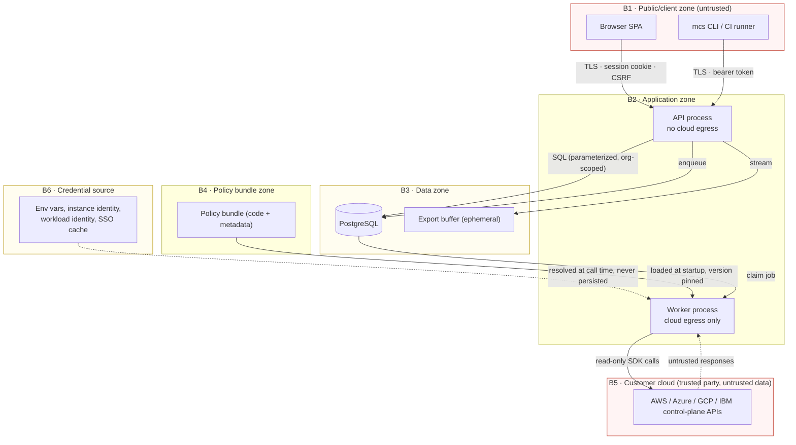

# Security Boundaries

Status: accepted for v0.1.0
Last updated: 2026-08-05

Where trust changes hands, what each boundary enforces, and — stated plainly — what v0.1.0 does
**not** isolate. Threats and mitigations are in [threat-model.md](threat-model.md); this document is
the structural map those mitigations attach to.

---

## 1. Boundary map

| Boundary | Crossing | Enforcement |
| --- | --- | --- |
| B1 → B2 | User/CI request | TLS, authentication, RBAC + `OrgScope`, request schema validation, body size limits, rate limiting, CSRF on cookie-authenticated mutations, security headers |
| B2 → B3 | Persistence | ORM-parameterized SQL only; repositories require `OrgScope`; least-privilege DB role; migrations run as a separate, higher-privileged role |
| B2 → B5 | Cloud reads | Fixed adapter registry; endpoints derived from SDK + validated region tokens, never user URLs; TLS verification mandatory; read-only operation allowlist; timeouts and bounded pagination |
| B5 → B2 | Cloud responses | **Untrusted input**: strict schema parsing, size/depth caps, control-character stripping, no dynamic dispatch on payload values |
| B6 → B2 | Credential resolution | Provider-native chains only; resolved per call; never written to DB, logs, exports, or error messages |
| B4 → B2 | Policy load | Bundle from the installed package or an explicitly configured path; version pinned into each scan; pure-function constraint enforced by lint + tests |
| B2 → B1 | Responses/exports | Redaction filter, problem-details errors without internals, `Content-Disposition: attachment`, `nosniff`, CSV formula neutralization |

---

## 2. Process separation and why it exists

The API process and the worker process run the same image with different entrypoints, but they have
**deliberately different capabilities**:

| | API process | Worker process |
| --- | --- | --- |
| Serves HTTP to users | Yes | No (health only, bound to localhost) |
| Outbound network to customer clouds | **No** | Yes |
| Cloud credentials in environment | **No** | Yes |
| Database access | Yes (app role) | Yes (app role) |
| Executes policy code | No | Yes |

This is the highest-value structural control in the design. The process that handles hostile,
internet-adjacent input has neither cloud credentials nor cloud egress; the process with cloud
credentials accepts no user-controlled requests. A request-handling vulnerability therefore does not
directly yield cloud access, and SSRF against the request-serving surface has nowhere to go.

It is enforced, not assumed:

- The API entrypoint asserts at startup that no provider credential environment variables are set,
  and refuses to start if they are (a deployment mistake becomes a loud failure).
- Compose and the documented deployment inject cloud credentials into the worker service only.
- An architecture test asserts that no module reachable from the API router imports a provider SDK.

---

## 3. Credential boundary (B6)

**MultiCloudShield never possesses a cloud secret.** Precisely:

| We store | We never store |
| --- | --- |
| `CredentialMechanism` (which chain to use) | Access keys, secret keys, session tokens |
| Role ARN / service account email / trusted profile ID | Client secrets, certificates, private keys |
| **Names** of environment variables holding secrets | The values of those variables |
| Region allowlists, scope IDs | Refresh tokens, SSO tokens, cookies |

Rules:

1. Credentials are resolved by the provider SDK's own chain at call time, inside the worker.
2. Resolved credential objects are never serialized, logged, cached to disk, or attached to
   exceptions. Adapter code holds them in a client object and nothing else.
3. The `credential_reference` column is validated against a per-mechanism key allowlist, screened for
   secret-shaped values and high-entropy strings, and excluded from every export.
4. `external_id` (AWS) is treated as secret-adjacent: accepted only as an environment variable name.
5. Error messages from SDKs pass through the redaction filter before being stored as `ScanError` or
   logged, because provider exceptions can echo request signatures and headers.

### Least-privilege posture

The operator grants a read-only role; we document the minimum permission set per collector so a
security team can grant exactly what is needed. `docs/planning/provider-coverage-matrix.md` lists the
permission each collector requires, and the connectivity test reports which are missing. We never
request write permissions, and a collector that would require one is rejected at design review.

---

## 4. Tenancy: what is and is not isolated in v0.1.0

**This section is normative.** Deployments must be planned against it.

### Isolated (enforced in code)

Every row in these tables carries `organization_id`, and every repository method that reads them
requires an `OrgScope` argument — there is no callable path that omits it:

`cloud_connection`, `scan`, `scan_target`, `scan_error`, `asset`, `asset_relationship`,
`policy_evaluation`, `evidence`, `finding`, `finding_status_change`, `user`, `api_token`, `session`.

Authorization is checked on every object fetch, not only on collection listing, so a valid ID from
another organization returns `404` (not `403` — we do not confirm existence across tenants).

### NOT isolated in v0.1.0

Stated explicitly so nobody assumes otherwise:

| Not isolated | Consequence | Post-MVP path |
| --- | --- | --- |
| **Database** — one schema, one app role, no row-level security | A SQL flaw or a repository bypass could cross organizations. Application-layer scoping is the only barrier. | PostgreSQL RLS with a per-request `SET LOCAL app.org_id` |
| **Policy catalog** | Global and identical for all organizations. No per-tenant policies. | Per-org policy overlays |
| **Worker pool and scan concurrency** | No per-tenant quota. One organization's large estate can delay another's scans. | Per-tenant queues and fair scheduling |
| **Rate limits** | Global and per-principal, not per-tenant. | Per-tenant budgets |
| **Logs and metrics** | One stream, tagged with `organization_id`. Anyone with log access sees all tenants. | Per-tenant log routing |
| **Process memory** | Scans for different organizations run in one worker process. | Per-tenant worker isolation |
| **Configuration and encryption keys** | Deployment-wide. | Per-tenant key derivation |
| **`Organization` count** | Exactly one is created and supported. Multi-org is a *seam*, not a *feature*. | Org provisioning, invitations, cross-org admin |

**Deployment guidance that follows from this:** v0.1.0 is intended for a single organization
assessing its own cloud estate. A consultancy assessing multiple clients should run **one deployment
per client** — separate database, separate credentials, separate container. Do not rely on the
`organization_id` column as a security boundary between mutually distrusting parties in v0.1.0.

---

## 5. Authentication and authorization boundary

### Principals

| Principal | Credential | Lifetime | Intended use |
| --- | --- | --- | --- |
| User | Password (Argon2id) → opaque session | Session cookie, idle + absolute expiry | Dashboard |
| API token | 256-bit random secret, SHA-256 at rest | Until revoked or expired | CLI, CI/CD |
| Bootstrap owner | Created by CLI at first run | — | Initial setup |

Sessions are **server-side and opaque** — a random identifier resolving to a database row. This makes
revocation immediate and correct. A stateless JWT would require either accepting a revocation window
or building a denylist, which is a session store with extra steps
([ADR-0011](decisions/0011-authentication-model.md)).

API tokens are formatted `mcs_pat_<public_id>_<secret>` so the public part indexes the lookup, the
secret part is compared against a stored hash in constant time, and the whole string is a
recognizable pattern for secret-scanning tools. Tokens are shown once, never retrievable.

### Roles

| Capability | `owner` | `analyst` | `viewer` |
| --- | --- | --- | --- |
| Read assets, findings, scans, policies | ✅ | ✅ | ✅ |
| Export findings | ✅ | ✅ | ✅ |
| Start / cancel scans | ✅ | ✅ | ❌ |
| Change finding status (with reason) | ✅ | ✅ | ❌ |
| Create / edit / test / delete connections | ✅ | ❌ | ❌ |
| Manage users and API tokens | ✅ | ❌ | ❌ |

Authorization is enforced in a single dependency at the route layer plus the `OrgScope` requirement
at the repository layer. Two layers, because route-level checks are the ones that get forgotten when
a new endpoint is added, and repository-level scoping catches that omission.

`viewer` exists specifically so an auditor or a stakeholder can be given access that cannot start
scans (which cost cloud API calls) or alter finding history.

---

## 6. Network boundary

### Ingress

- The API listens on one port. TLS is expected to be terminated by the operator's reverse proxy;
  the documented Compose stack includes one, and the app sets `Secure` cookies and HSTS accordingly.
- Body size limits, request timeouts, and per-principal rate limits are applied before handler logic.
- CORS is **disabled by default**: the SPA is served from the same origin as the API, so no
  cross-origin credentialed requests are needed. Enabling CORS requires an explicit allowlist —
  wildcard with credentials is rejected by configuration validation.

### Egress

The worker's only intended outbound destinations are cloud provider control-plane APIs.

- Endpoints come from the SDKs' own resolution plus a **validated region token** (`^[a-z0-9-]{2,32}$`
  matched against a per-provider known-region set). Users cannot supply URLs.
- Sovereign/partition endpoints (GovCloud, China, Azure Government, sovereign IBM regions) are
  selected by a **named partition enum**, not a URL — this keeps a legitimate feature from becoming
  an SSRF vector ([threat-model.md](threat-model.md) §T4).
- HTTP redirects are not followed on cloud API clients; TLS verification cannot be disabled by
  configuration (there is no such setting).
- No outbound webhooks, notifications, telemetry, or update checks exist in v0.1.0. The product makes
  no network call the operator did not ask for.
- Operators are advised to run the worker with an egress allowlist; the documentation lists the
  domains required per provider.

---

## 7. Data boundary

| Class | Examples | Handling |
| --- | --- | --- |
| **Secret** | Cloud credentials, session IDs, token secrets, password hashes | Never persisted (cloud creds), or hashed; never logged; never exported; redacted in errors |
| **Sensitive** | Principal identifiers, IP ranges, resource names, tags | Persisted; pseudonymizable on export; excluded from log messages |
| **Operational** | Scan stats, timings, error categories | Persisted and logged freely |
| **Public** | Policy catalog, severity rubric | Freely readable |

Raw provider payloads are not persisted by default. When explicitly enabled for debugging, the
retention is per-connection and time-boxed, the setting is logged loudly at startup, and the payload
still passes through redaction.

Database credentials come from the environment; the application role has `SELECT/INSERT/UPDATE/DELETE`
on application tables and no DDL rights. Migrations run as a separate role in a separate step, so a
compromised application process cannot alter the schema.

---

## 8. Supply-chain and build boundary

| Boundary | Control |
| --- | --- |
| Dependency ingestion | Fully pinned lockfile with hashes; automated update PRs reviewed like code; vulnerability scan on every PR |
| CI execution | Least-privilege `GITHUB_TOKEN` (read by default, elevated per job); third-party actions pinned to commit SHA; no `pull_request_target` on untrusted forks; no secrets exposed to fork-originated workflows |
| Policy bundle | Ships inside the package; loading an external bundle is opt-in with a documented trust statement — **a policy bundle is executable code and is trusted accordingly** |
| Container image | Non-root user, no shell-based entrypoint, read-only root filesystem where possible, minimal base, no build toolchain in the runtime layer, image scanned in CI |
| Release artifacts | SBOM generated per release; artifact provenance attestation where the platform supports it |

---

## 9. What an attacker gains at each boundary

Useful for prioritizing controls — the answer to "so what?" for each compromise.

| Compromise | Immediate gain | Blocked from | Because |
| --- | --- | --- | --- |
| Stolen session cookie | Dashboard access at that user's role | Cloud credentials, other orgs' data | No creds in API process; org-scoped repositories; short idle expiry |
| Stolen `viewer` API token | Read findings and exports | Starting scans, changing status, connections | RBAC |
| Stolen `owner` API token | Full app control, including connection config | Cloud secrets (none stored) | Credentials live in the worker's environment, not the DB |
| RCE in the API process | App data, DB access | Cloud credentials, cloud egress | Process separation §2 |
| RCE in the worker process | **Cloud read access at granted scope**, DB access | Cloud writes | Read-only IAM role on the cloud side — this is why least privilege is the operator's most important control |
| Malicious policy bundle | Code execution in the worker | — | Bundles are trusted code; only install ones you trust |
| Compromised database | All findings, hashes, session IDs | Cloud credentials | Not stored |
| Compromised CI | Ability to publish a malicious release | Repository secrets on fork PRs | Least-privilege tokens, pinned actions, no fork secret exposure |

The row that drives operator documentation: worker RCE yields exactly the cloud access the operator
granted. That is the argument for granting a scoped read-only role rather than a broad one, and it is
why the coverage matrix documents per-collector permissions instead of just recommending a
provider's broadest read-only managed policy.
