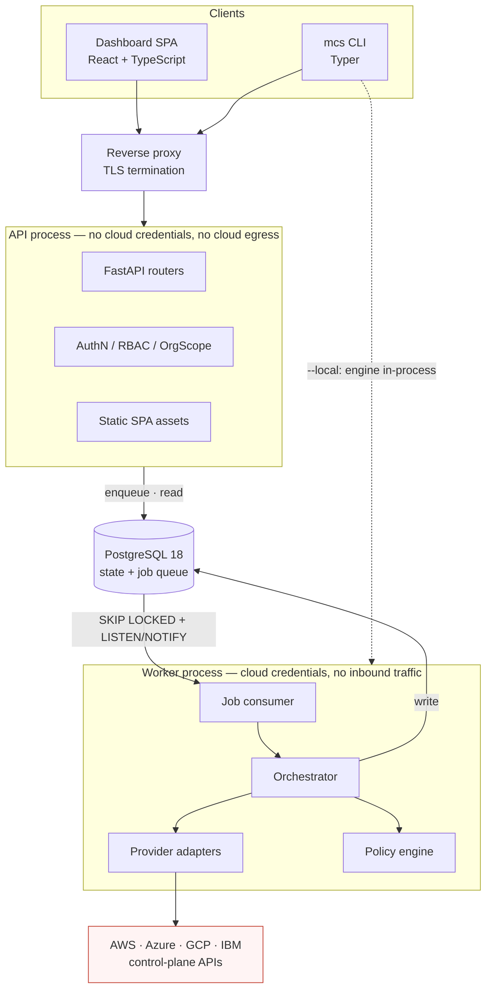

# System Design

Status: accepted for v0.1.0
Last updated: 2026-08-05

The system as a whole: components, module structure, the selected stack, and the cross-cutting
mechanisms. Decisions and their rejected alternatives live in
[decisions/](decisions/); this document is the assembled picture.

---

## 1. Shape of the system

A **modular monolith** in one codebase and one container image, run as two process roles that differ
in capability, backed by PostgreSQL.



The two roles are the same image with different entrypoints. Their **capability difference is the
design** ([security-boundaries.md](security-boundaries.md) §2): the process exposed to hostile input
holds no cloud credentials and has no cloud egress; the process with credentials accepts no user
requests. A request-handling vulnerability therefore does not yield cloud access.

---

## 2. Module structure

Dependencies point **inward and downward only**, enforced by import-linter in CI
([ADR-0002](decisions/0002-modular-monolith.md)).

```
src/multicloudshield/
  config/        Settings, validation, startup assertions       → nothing
  core/          Domain models, enums, errors, URNs, fingerprints → nothing
  facts/         Fact schemas, TriState, FactView               → core
  policy/        Bundle loader, engine, verdicts                → core, facts
    bundle/      The shipped policies (yaml + evaluate.py)
  providers/     Adapter contract, registries, per-provider     → core, facts
    aws/ azure/ gcp/ ibm/ demo/
  engine/        Orchestrator, concurrency, retry, reconciliation → core, facts, policy, providers
  persistence/   SQLAlchemy models, migrations, repositories    → core
  queue/         JobQueue interface + procrastinate adapter     → core
  api/           Routers, schemas, auth, error model            → core, persistence, engine, queue
  worker/        Job consumer, scan execution                   → everything
  cli/           Typer commands, remote + local modes           → core, engine, api client
```

Four rules carry most of the value:

1. `core` and `facts` import nothing above them — the domain has no framework.
2. `policy` imports no provider and no persistence code — policies cannot reach a cloud or a database.
3. `providers` imports no persistence and no API code — adapters cannot write to the database.
4. **`api` imports no provider SDK** — asserted by test, which is what makes the capability separation
   real rather than aspirational.

`engine/` is the load-bearing seam: it depends on policy and providers but **not on persistence**, so
it can run with a serializing sink instead of a database. That is what makes
`mcs scan --local` a mode rather than a second implementation
([ADR-0025](decisions/0025-stateless-local-scan-mode.md)).

---

## 3. Selected stack

All versions verified 2026-08-05. Rationale and rejected alternatives are in the linked ADRs.

### Backend

| Concern | Choice | ADR |
| --- | --- | --- |
| Language | Python — floor 3.12, CI primary 3.13 | [0003](decisions/0003-backend-language.md) |
| Framework | FastAPI 0.141.x on Starlette 1.4.x, Uvicorn 0.52.x | [0004](decisions/0004-backend-framework.md) |
| Models / validation | Pydantic 2.13.x, pydantic-settings 2.14.x | [0004](decisions/0004-backend-framework.md), [0015](decisions/0015-configuration.md) |
| Database | PostgreSQL **18** (required) | [0005](decisions/0005-database-and-orm.md) |
| ORM / driver | SQLAlchemy 2.0.x async, `psycopg` 3.3.x | [0005](decisions/0005-database-and-orm.md) |
| Migrations | Alembic 1.19.x | [0005](decisions/0005-database-and-orm.md) |
| Job queue | `procrastinate` 3.9.x behind a `JobQueue` interface | [0006](decisions/0006-background-execution.md) |
| CLI | Typer 0.27.x | [0025](decisions/0025-stateless-local-scan-mode.md) |
| HTTP client | **`httpx2` 2.9.x** (stewardship moved from `httpx`) | [0017](decisions/0017-testing-strategy.md) |
| Logging | structlog 26.x, JSON, redacting | [0016](decisions/0016-observability.md) |
| Passwords | `argon2-cffi`, m=19456 t=2 p=1 | [0011](decisions/0011-authentication-model.md) |

### Cloud SDKs

`boto3` 1.43.x · `azure-identity` 1.25.x with `azure-mgmt-*` · `google-cloud-*` (all GA) ·
`ibm-platform-services` 0.77.x, `ibm-vpc` 0.34.x, `ibm-cos-sdk` 2.16.x. Per-provider maturity,
quirks, and gaps: [provider-adapters.md](provider-adapters.md) §4.

### Frontend

React 19.2 · TypeScript **6.0** (7.0 is a tracked follow-up) · Vite 8.2 · TanStack Query 5 ·
React Router 8 · Tailwind 4.3 · shadcn/ui (base pinned) · Recharts 3.10 ·
`openapi-typescript` + `openapi-fetch` + `openapi-react-query` · Node 24 LTS.
[ADR-0014](decisions/0014-frontend-stack.md).

### Tooling

`uv` 0.12.x · Ruff 0.16.x (lint **and** format, replacing Black/isort/flake8) · mypy 2.3.x strict ·
pytest 9.x · Schemathesis 4.x · moto 5.x · vcrpy 8.x · `@playwright/test` 1.62 · pre-commit ·
Syft/`anchore/sbom-action` → `actions/attest` · pip-audit + Trivy + Dependabot.
[ADR-0017](decisions/0017-testing-strategy.md), [0019](decisions/0019-ci-cd.md),
[0022](decisions/0022-dependency-management.md).

### Deliberately absent

No Redis, Kafka, Elasticsearch, Kubernetes, message broker, cache, search engine, secret store, or
outbound telemetry. Each was considered and none has a demonstrated MVP need.

---

## 4. Request and job paths

### Read path

`Client → reverse proxy → FastAPI router → auth dependency (principal → OrgScope + role) →
org-scoped repository → PostgreSQL → response`

Authorization is enforced twice: a route-level RBAC dependency and a repository layer that **cannot be
called without an `OrgScope`**. The first is what gets forgotten on a new endpoint; the second catches
that ([ADR-0012](decisions/0012-authorization-model.md)).

### Scan path

`API enqueues → PostgreSQL job row + NOTIFY → worker claims with SKIP LOCKED → orchestrator fans out
scan targets → adapters collect → normalizers validate → policy engine evaluates → findings reconciled
→ PostgreSQL`

Fully sequenced in [data-flows.md](data-flows.md) §3.

---

## 5. Cross-cutting mechanisms

### Error model

One taxonomy, three surfaces.

- **API** — RFC 9457 problem details with a stable machine-readable `code`, never a stack trace, SQL
  fragment, internal path, or provider exception text.
- **Scan** — `ScanError` rows with a `ScanErrorCategory` ([domain-model.md](domain-model.md) §4, ScanError).
  `permission_denied` carries the exact missing IAM action so the UI can render an instruction rather
  than a failure.
- **CLI** — documented exit codes: `0` clean, `2` findings at or above `--fail-on`, `3` scan failed,
  `4` partial results.

Every message crossing a boundary passes through redaction.

### Concurrency and bounds

Three nested semaphores (global 16, per-connection 8, per-provider-per-connection 4), per-call
timeout 30 s, per-target deadline 5 min, per-scan deadline 60 min, `max_pages_per_target` 200,
`max_items_per_target` 50 000. Exponential backoff with full jitter on throttling and 5xx; **no retry**
on `permission_denied`, `not_found`, or `service_disabled`.

We deliberately do not maximize throughput. The failure mode of an aggressive scanner is throttling a
customer's production account, which is a worse outcome than a slow scan.

Collection uses a **bounded thread pool**, not asyncio: boto3 is synchronous and its async wrappers are
not first-party ([ADR-0006](decisions/0006-background-execution.md)).

### Determinism

Evaluation is a pure function of facts, pinned per scan by `policy_bundle_version`, `engine_version`,
and `collector_set_digest`. Enforced by a lint rule banning I/O imports in the policy bundle, sorted
iteration, canonical JSON digests, and a golden-file CI job over a frozen fact corpus
([ADR-0010](decisions/0010-determinism-and-evidence.md)).

### Data minimization

Raw provider payloads are **not persisted** by default; we store normalized facts plus response
digests. No collector reads data-plane content. Full table in
[domain-model.md](domain-model.md) §9.

### Idempotency

Assets upsert by `asset_urn`, evaluations by `(scan_id, policy_id, asset_id, sub_locator)`, findings by
`fingerprint`, scan creation by `Idempotency-Key`. This is what makes at-least-once job execution safe.

---

## 6. What runs where

| | API | Worker | CLI remote | CLI `--local` |
| --- | :-: | :-: | :-: | :-: |
| HTTP server | ✅ | ❌ | — | — |
| Cloud credentials | ❌ | ✅ | ❌ | ✅ |
| Cloud egress | ❌ | ✅ | ❌ | ✅ |
| Database | ✅ | ✅ | ❌ | ❌ |
| Policy execution | ❌ | ✅ | ❌ | ✅ |
| Authentication | ✅ | — | ✅ | ❌ (process-level only) |

`mcs scan --local` has no application authorization — it is bounded by the cloud credentials in its
environment, exactly like the AWS CLI. Stated explicitly so nobody expects otherwise.

---

## 7. Scaling, and what we are not building

Present limits and their intended path, so nobody mistakes a deliberate limit for an oversight:

| Limit | v0.1.0 | Path |
| --- | --- | --- |
| Workers | One | The queue already supports multiple consumers — run more containers |
| Tenants | One organization; application-layer scoping | PostgreSQL RLS, then real multi-tenancy |
| Scan trigger | Manual only | Scheduled scans (procrastinate has periodic tasks built in) |
| Scan scope | One account/subscription/project per connection | Organization/folder/management-group hierarchies |
| Bulk inventory | Per-service SDK calls | Resource Graph / Cloud Asset Inventory as collectors behind the same contract |
| Deployment | Docker Compose | Kubernetes if demand appears |

None of these requires an architectural change. That is the test of whether the modular monolith was
the right call.
