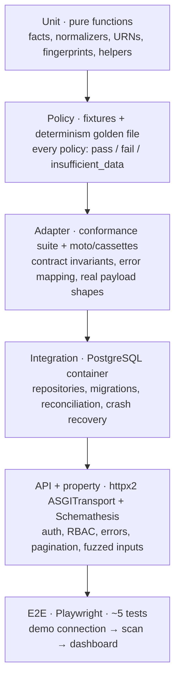

# Testing Strategy

Status: accepted for v0.1.0
Last updated: 2026-08-05

What we test, with what, and why. The decision — recorded fixtures, never live cloud in CI — is
[ADR-0017](decisions/0017-testing-strategy.md).

The premise: **a CSPM's correctness is its product.** A crash is visible; a wrong verdict is not. The
suite is weighted toward the layers where a bug produces a wrong security answer, and two tests are
release blockers because they guard failures that would make the tool actively harmful.

---

## 1. The shape



Not a strict pyramid: the **policy** and **adapter conformance** layers are disproportionately large,
because that is where a defect becomes a wrong verdict on a customer's estate.

---

## 2. Unit tests

Pure functions, no I/O: fact schema validation and `TriState` coercion, normalizer mapping, `asset_urn`
construction, finding fingerprints, severity rubric resolution, retry/backoff calculation, redaction
patterns, CSV cell neutralization, cursor encoding.

Property-based tests (Hypothesis) where a property is clearer than examples:

- Round-tripping a fact model preserves `facts_digest`.
- `asset_urn` is stable across two constructions from the same inputs.
- Fingerprints are stable under policy version and severity changes, and unique across
  `sub_locator` values.
- CSV neutralization never produces a cell a spreadsheet would evaluate.

---

## 3. Policy tests

Every policy ships with fact fixtures — **not** provider payloads — so tests need no cloud, no network,
and no adapter.

```
fixtures/
  pass.yaml
  fail_public_acl.yaml
  insufficient_data_unreadable.yaml
  not_applicable_wrong_type.yaml
```

Required per policy: at least one `pass`, one `fail`, and one `insufficient_data`. The last is
mandatory because unknown-handling is the highest-value correctness property in the system and the
easiest to omit.

The bundle-wide conformance suite asserts, for every policy:

- Metadata validates; ID unique; version valid SemVer.
- **Declared `requires_facts` equals actually-accessed facts** (compared against the `FactView` trace).
- A policy reading `provider_specific.<p>.*` narrows `provider_applicability` to `<p>`.
- No banned import (network, filesystem, clock, environment, randomness).
- `evaluate` has the exact expected signature.
- Compliance mappings carry framework, version, control ID, relationship, and note — and no long
  verbatim external control text.

---

## 4. Adapter tests

### Conformance suite — one suite, every adapter

Parameterized across AWS, Azure, GCP, IBM, and demo
([provider-adapters.md](provider-adapters.md) §8): typed observations, registered normalizers,
well-formed and stable URNs, every declared fact populated or explicitly `unknown`, cancellation
observed within one page, page and item budgets respected, exhaustive error-category mapping,
**no non-allowlisted operation attempted**, non-empty valid `required_permissions`, and no network
access when driven by fixtures.

A new adapter that passes this is structurally correct. Fact *accuracy* is a separate concern —
conformance cannot tell whether a bucket really is public.

### Behaviour against real payload shapes

| Provider | Mechanism |
| --- | --- |
| AWS | `moto` 5.x, plus `vcrpy` cassettes for operations moto does not cover |
| Azure, GCP, IBM | `vcrpy` cassettes only — no credible mock server exists for these |

**moto's coverage must be verified per operation, not assumed.** It documents 161 services and covers
the CSPM-critical ones, but coverage is tracked per API operation and varies; `describe_*`/`list_*`
are best covered. Each specific call a collector makes is checked against moto before relying on it,
with a cassette as the fallback.

Cassettes are recorded through a helper that **scrubs account IDs, ARNs, subscription and tenant GUIDs,
project IDs, and tokens** automatically — not left to reviewer discipline. A CI check scans fixtures
and cassettes for credential patterns and real identifiers.

Required fixture scenarios per collector: success with data, empty result, **multi-page pagination**,
permission denied, throttled-then-success, service disabled, and a malformed payload.

---

## 5. Determinism

A frozen fact corpus — a few hundred assets across all providers, including edge cases — is evaluated
twice per CI run and diffed against a committed golden file covering `result`, `reason_code`,
`severity`, `observed_facts`, and `content_digest`.

Any difference fails the build. **The golden file is reviewed as a behaviour change, not a fixture
update:** a diff there means findings on real estates will change, and the pull request must say why.

This is also the mechanism that makes policy edits safely reviewable — "what would this change do to
existing findings?" is answerable before merge.

---

## 6. Integration tests

Against a real PostgreSQL 18 container (never SQLite — the dialects differ in ways that matter,
[ADR-0005](decisions/0005-database-and-orm.md)).

- Repositories, including **`OrgScope` enforcement**: a test asserts that no repository method can be
  called without a scope, and that cross-organization reads return nothing.
- Migrations: forward from empty, forward from the previous release, and downgrade where reversible.
- Idempotent replay: re-running a scan produces no duplicate assets, evaluations, or findings, and
  preserves `first_seen_*`.
- **Finding reconciliation**, the highest-value integration surface:

| Scenario | Expected |
| --- | --- |
| New failure | Finding created, `open` |
| Same failure again | `last_seen_*` updated, `first_seen_*` unchanged |
| Pass on a succeeded target | `resolved` |
| `insufficient_data` | Stays `open`, marked stale |
| Target failed | Stays `open`, marked stale |
| Asset absent after a **successful** full collection | `resolved` |
| Asset absent after a **failed** collection | Stays `open` |
| Human status (`risk_accepted`, `suppressed`, `false_positive`) still failing | Status unchanged |
| Resolved finding fails again | Reopened, original `first_seen_at` preserved |
| Cancelled scan | No finding created, resolved, or reopened |

- **Fault injection:** worker killed mid-scan → lease expires → job requeued → scan completes with no
  duplicates.
- **Load check:** a 10 000-asset synthetic demo estate completes within the scan deadline without
  unbounded memory growth.

---

## 7. API tests

`httpx2.AsyncClient` with `ASGITransport` (not Starlette's `TestClient`, which runs its own event loop
and conflicts with async fixtures; `base_url` must be set for relative URLs).

- **Route audit:** enumerate routes from the app and assert each has an authentication dependency and a
  declared role. This is the test that prevents an endpoint shipping without auth — it walks the route
  *tree*, since FastAPI 0.137.0 changed `router.routes` from a flat list.
- RBAC per role per route; cross-organization access returns `404`.
- Error model: every error is problem details with a stable code and no stack trace, SQL, path, or
  provider exception text.
- Pagination, filtering, sorting, bounded page size.
- `/healthz` without database access; `/readyz` failing when migrations are pending.
- Export correctness including CSV formula neutralization.
- **Schemathesis** against the generated OpenAPI, targeting unhandled `500`s on malformed input.

---

## 8. Frontend tests

- Component tests (Vitest + Testing Library) for the four designed states of each list view: empty,
  loading, **partial failure**, error.
- A dedicated test rendering hostile provider strings (HTML, script fragments, control characters,
  `=cmd|'/c calc'!A1`) and asserting inert output.
- Generated-client diff check: the client regenerated from the current OpenAPI must match what is
  committed.
- **E2E (`@playwright/test`)**, ~5 tests, against demo with no network: seed → scan → findings list →
  filter → finding detail with evidence → CSV export; plus the partial-failure scan view; plus a
  `viewer` blocked from starting a scan.

---

## 9. Coverage and gates

Coverage thresholds are high on `core`, `facts`, `policy`, and `engine` — where a bug produces a wrong
verdict — and pragmatic elsewhere. **100% is explicitly not a goal**; a suite optimized for a number
tests getters.

### Release-blocking tests

1. **Total-failure regression gate** — a scan in which every target fails resolves **zero** findings.
   Without it, a permission regression turns the dashboard green (threat T18).
2. **Read-only proof** — no cloud mutation operation is reachable from any adapter, and the operation
   allowlist rejects an unlisted call before any request is sent (threat T15).

### Every pull request

Format, lint, strict typing, import rules, unit, policy, determinism, adapter conformance, integration,
API, Schemathesis, frontend build and tests, generated-client diff, demo E2E, `pip-audit`, secret scan,
fixture credential-pattern check, ADR index check, compliance-text check.

The suite runs **entirely offline** — no cloud credentials, no network — which is what makes it fast,
deterministic, and safe to run on fork pull requests.

---

## 10. Known gap

**Provider API drift is not caught by CI.** Because we deliberately hold no cloud credentials in CI, a
provider changing a response shape is discovered by a user, not by a test.

Accepted, and mitigated by: strict parsing that fails loudly as `parse_error` rather than silently
mis-normalizing; `parse_error` treated as suspicious rather than routine; and a maintainer-run,
out-of-band verification against disposable sandbox accounts before each release, documented as a
runbook rather than automated in the public repository.

Recorded in [risk-register.md](../planning/risk-register.md).
