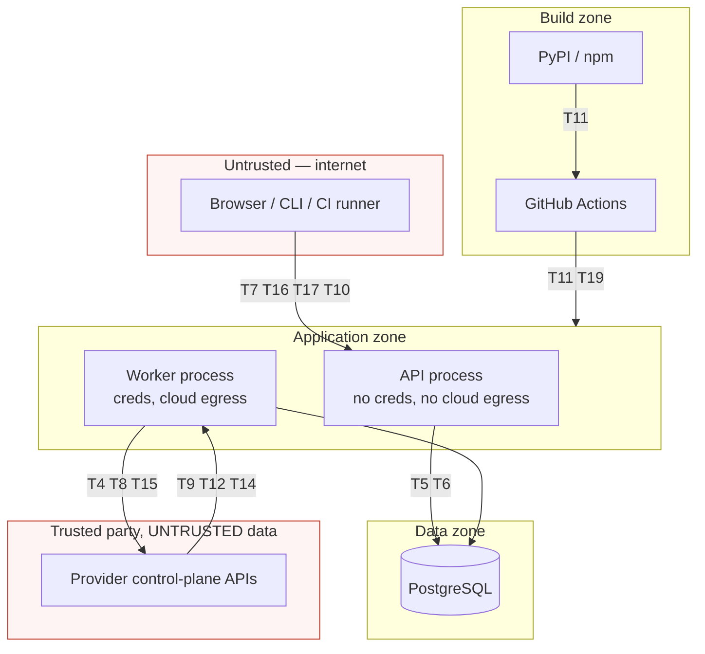

# Threat Model

Status: accepted for v0.1.0
Last updated: 2026-08-05

Threats to MultiCloudShield itself. Structural controls are in
[security-boundaries.md](security-boundaries.md); this document enumerates what we are defending
against, what we do about it, and what we knowingly accept.

Standards referenced (versions verified 2026-08-05): **OWASP Top 10:2025** — note the 2021 edition is
superseded, and A03 is now *Software Supply Chain Failures* and A10 is *Mishandling of Exceptional
Conditions*; **OWASP API Security Top 10:2023**; **OWASP ASVS 5.0.0**; **NIST SP 800-53 Rev. 5**;
**NIST SP 800-190** (containers); **SLSA v1.2**.

---

## 1. What we are protecting

| Asset | Why it matters | Where it lives |
| --- | --- | --- |
| **Cloud read access** | Highest-value target. Yields a customer's whole control-plane inventory | Worker process environment only — never our database |
| **Findings and inventory** | A precise map of a customer's weaknesses. Valuable to an attacker even without credentials | PostgreSQL |
| **Evidence and provenance** | The basis on which security decisions are made. Forgery undermines the product's purpose | PostgreSQL |
| **Application credentials** | Sessions, API tokens, password hashes | PostgreSQL |
| **Build and release pipeline** | Compromise reaches every user | GitHub |
| **Product integrity** | A CSPM that silently under-reports is worse than none | Everywhere |

The last one deserves emphasis. **The worst outcome is not a breach of MultiCloudShield — it is
MultiCloudShield reporting "all clear" when it is not.** Several threats below (T14, T18, T19) are
about correctness rather than confidentiality, and they are rated accordingly.

## 2. Adversaries

| Adversary | Capability | Motivation |
| --- | --- | --- |
| External unauthenticated | Reach the API endpoint | Access findings; pivot to cloud credentials |
| Authenticated low-privilege (`viewer`) | Valid credential | Escalate; access other connections' data |
| Malicious contributor | Submit a pull request | Insert a backdoor or a silently-passing policy |
| Compromised dependency | Code execution in our process | Exfiltrate credentials or findings |
| **Attacker inside the scanned cloud** | Control resource names, tags, IAM documents | **Inject into our pipeline via provider metadata** |
| Curious insider | Log or database access | Read other tenants' data |
| Compromised CI | Modify workflows or releases | Supply-chain attack on every user |

The fifth deserves emphasis too: an attacker who can create a resource in a scanned account controls
strings that flow into our normalizer, database, UI, CSV exports, and logs. **The provider is a
trusted party; provider data is not.**

## 3. Trust boundaries

---

## 4. Threats

Severity is the residual risk after the stated mitigations.

### T1 · Accidental cloud credential disclosure — residual: low

**Threat.** A cloud credential enters our system and leaks via the API, database, logs, exports, or an
error message.

**Mitigations.**
- **We never possess one** ([ADR-0013](decisions/0013-credential-handling.md)). The database stores
  mechanism plus non-secret references; credentials are resolved by the provider's own chain at call
  time in the worker.
- `credential_reference` is validated against a per-mechanism key allowlist, screened for
  credential-shaped and high-entropy values, and rejected with `422` — **the offending value is never
  echoed back**, since error messages are themselves a disclosure channel.
- `external_id` is accepted only as an environment variable *name*.
- Resolved credential objects are never serialized, cached, or attached to exceptions.
- Configuration secrets are `SecretStr`, whose `repr` is redacted.

**Residual.** An operator could still put a secret in a connection *name* or *description*. Free-text
fields are screened by the same detector.

### T2 · Overprivileged cloud credentials — residual: medium

**Threat.** The operator grants broad permissions because narrow ones are hard, so a worker compromise
yields far more access than the tool needs.

**Mitigations.**
- Every collector **declares** `required_permissions` in code; the least-privilege policy documents
  are generated from those declarations, so they cannot drift from what we actually call.
- The connectivity test reports `degraded` naming each missing permission, making incremental granting
  practical.
- Per-provider guidance leads with the minimal policy. For AWS we recommend **`SecurityAudit`** as the
  fallback, explicitly **not `ReadOnlyAccess`** — whose `s3:Get*` wildcard includes `s3:GetObject`,
  i.e. customer object data ([provider-adapters.md](provider-adapters.md) §4.1).
- `unknown` facts produce `insufficient_data` rather than a silent pass, so narrow permissions are
  *safe* — the tool tells you what it could not see instead of punishing you for least privilege.

**Residual.** We cannot stop an operator granting Owner. Documented, and it is the reason
[security-boundaries.md](security-boundaries.md) §9 spells out exactly what a worker compromise yields.

### T3 · Secrets in logs, exceptions, fixtures, exports — residual: low

**Threat.** Credentials appear in a log line, a stack trace, a test fixture, a screenshot, or an
export.

**Mitigations.**
- The redaction processor is installed on the **root log handler**, not only ours — because
  `botocore` at debug level will emit signed request headers, and third-party logs are where
  credentials actually escape.
- The pattern corpus covers AWS key prefixes (`AKIA`/`ASIA`/`ABIA`/`ACCA` + 16 chars) and secret keys
  when contextually adjacent; GCP service-account JSON fields and PEM blocks; Azure `AccountKey=` and
  SAS `sig=` (including sovereign suffixes such as `core.chinacloudapi.cn`); IBM `apikey`-family field
  names; `Authorization: Bearer|Basic`; JWTs; and database URLs with embedded passwords. Verified by a
  dedicated test against realistic samples ([AC-ENG-3](../planning/acceptance-criteria.md)).
- Session IDs are logged only as **salted hashes**; access tokens, passwords, and connection strings
  are never logged, per the OWASP Logging Cheat Sheet's exclusion list.
- **Fixtures are scanned for credential patterns and real account identifiers in CI** — fixtures are
  the single most likely place for a real secret to enter the repository.
- Screenshots for documentation are produced from demo mode, which has no real identifiers.

**Residual.** A novel credential format could evade the patterns. Redaction is the last line; the
primary control is never placing credentials in log-bound structures.

### T4 · Server-side request forgery — residual: low

**Threat.** User input controls an outbound request target, reaching cloud metadata services or
internal networks.

This is more real than "we only call SDK endpoints" suggests. **AWS SDKs honour
`AWS_ENDPOINT_URL`, `AWS_ENDPOINT_URL_<SERVICE>`, and a client-constructor `endpoint_url`.** A
connection model that stored a user-supplied endpoint and passed it to boto3 would be a *stored,
replayable* SSRF sink executed with our network position and credentials attached to a signed request.
Legitimate reasons to want it exist: AWS partitions (`aws-cn`, `aws-us-gov`, `aws-iso*`), Azure
sovereign suffixes, Azure Stack, GCP `api_endpoint`, IBM regional endpoints.

**Mitigations.**
- **Users never supply a URL.** Sovereign and partition endpoints are selected by a **named partition
  enum**; regions are validated against a per-provider known-region set (`^[a-z0-9-]{2,32}$`). URLs
  are constructed server-side from fixed templates.
- **The API process makes no outbound cloud calls at all** — the process reachable from the internet
  has no egress path to abuse ([security-boundaries.md](security-boundaries.md) §2).
- Redirects are **not followed** on cloud API clients — a `302` to `169.254.169.254` bypasses any
  pre-request URL validation.
- TLS verification cannot be disabled; there is no such setting.
- **No outbound webhooks, notifications, telemetry, or update checks exist in v0.1.0**, which
  eliminates the classic arbitrary-destination case entirely.
- Operators are advised to run the worker behind an egress allowlist; documentation lists the required
  domains per provider, and blocking `169.254.0.0/16` and RFC 1918 is recommended as defence in depth.

**Note for future features.** If webhooks or OIDC discovery URLs are ever added, they are
arbitrary-destination sinks requiring the full treatment: blocklist link-local and private ranges
(including IPv6 `fd00:ec2::254` and `fd20:ce::254`), resolve once and **connect to the validated IP**
to defeat DNS rebinding, and never send findings to an unvalidated host. This is recorded in
[backlog.md](../planning/backlog.md) so the requirement travels with the feature.

*Context on why metadata services matter here:* AWS IMDSv2 resists SSRF through four independent
properties — it requires a `PUT`, a custom header, rejects requests carrying `X-Forwarded-For`, and
defaults to a hop limit of 1. Azure IMDS and the GCP metadata server require a custom header and
reject `X-Forwarded-For` but have no session-token or hop-limit step, so they are weaker. IBM's
metadata service is **disabled by default**. These asymmetries are useful future policy checks and are
noted in [backlog.md](../planning/backlog.md).

### T5 · Injection: SQL, command, template, log — residual: low

**Threat.** Attacker-controlled input alters a query, a command, a rendered template, or a log record.

**Mitigations.**
- **SQL** — SQLAlchemy parameterized queries only; no string-built SQL. JSONB predicates are built by
  the repository layer, not by callers.
- **Command** — the product executes **no shell commands**. Remediation snippets are rendered as text
  and never executed ([T15](#t15--unauthorized-remediation--residual-very-low)).
- **Template** — the frontend is React, which escapes by default; `dangerouslySetInnerHTML` is banned
  by lint. No server-side HTML templating exists.
- **Log** — structured fields, never interpolated strings, so provider-controlled text cannot forge a
  log line. Control characters are stripped at normalization.
- **Policy inputs** — policies receive only typed, validated facts. There is no expression evaluation,
  no `eval`, and no dynamic dispatch on payload content.
- **CSV** — see [T13](#t13--insecure-file-exports--residual-low).

### T6 · Cross-tenant / cross-connection data exposure — residual: medium

**Threat.** One organization's data is visible to another; or a user sees a connection they should not.

**Mitigations.**
- `organization_id` on every tenant-scoped table from the first migration; every repository method
  **requires an `OrgScope`** that only the auth dependency can construct. There is no unscoped
  variant, so omitting it is a type error rather than a review miss.
- Cross-organization fetches return `404`, not `403` — we do not confirm existence across tenants.
- An audit test enumerates routes and asserts each uses an org-scoped repository.

**Residual: this is the largest accepted risk in v0.1.0.** There is **no PostgreSQL row-level
security**; application-layer scoping is the only barrier, and v0.1.0 supports exactly one
organization. Mutually distrusting parties (for example a consultancy's clients) **must get separate
deployments**. Stated normatively in [security-boundaries.md](security-boundaries.md) §4 and in
[SECURITY.md](../../SECURITY.md), not left to inference. RLS is the post-MVP hardening step.

### T7 · Insecure direct object references — residual: low

**Threat.** A user accesses another user's or organization's object by supplying its identifier.
(OWASP API Security Top 10:2023 API1 — Broken Object Level Authorization; the most common API flaw.)

**Mitigations.**
- **Every object fetch is authorized**, not just collection listings. Unguessable identifiers are
  defence in depth, never the access control.
- Identifiers are UUIDv7 (PostgreSQL 18 native). These leak creation time and are partially sequential
  — accepted explicitly, because authorization is enforced on every fetch and creation time is already
  visible on returned objects ([ADR-0005](decisions/0005-database-and-orm.md)).
- Filter parameters (`connection_id`, `scan_id`, `policy_id`) are validated as belonging to the
  caller's organization before use, so a filter cannot become a read primitive.
- Route-level RBAC plus repository-level scoping: two layers, because the route check is the one
  forgotten when an endpoint is added.

### T8 · Scan target manipulation — residual: low

**Threat.** An attacker causes a scan to target a cloud scope the operator did not authorize, using
the tool as a scanning proxy.

**Mitigations.**
- Scans target a **registered `CloudConnection`** only. Scope cannot be supplied per scan.
- `resolve_scopes()` intersects discovered scopes with the connection's `region_allowlist` and never
  discovers outside the registered scope.
- Creating or editing a connection is `owner`-only.
- Scans are bounded by concurrency caps, deadlines, and page budgets, so even an authorized scan cannot
  become a high-volume tool against a third party.
- Every scan records the requesting principal.

### T9 · Malicious provider metadata — residual: low

**Threat.** An attacker who can create resources in a scanned account controls strings — bucket names,
tags, IAM policy documents, resource descriptions — that flow into our normalizer, database, UI,
exports, and logs. **This is the most under-appreciated threat in a CSPM.**

**Mitigations.**
- **Normalization is the validation boundary.** Strict Pydantic parsing; unknown fields are ignored,
  never passed through.
- Size and nesting caps **before** parsing (5 MB per resource, depth 32).
- Rendered strings are length-capped and stripped of control characters.
- No dynamic dispatch on payload content; `provider_resource_type` selects a normalizer from a **fixed
  registry**, never by import or attribute lookup.
- Parse failure is a `ScanError(parse_error)` — the target degrades, the scan continues, and the error
  category is treated as **suspicious** rather than routine.
- Output encoding at every sink: React escaping, CSV neutralization, structured logging.
- **The demo estate deliberately contains hostile strings** (HTML, script fragments, control
  characters, and a formula-injection payload) so these paths are exercised on every CI run rather
  than only when a real attacker tries them.

### T10 · Denial of service — residual: low

**Threat.** Unbounded scans, pagination, exports, or requests exhaust memory, CPU, or database.

**Mitigations.**
- Collectors **stream** (`Iterator[RawObservation]`); raw payloads are discarded after normalization.
- Hard caps: `max_pages_per_target` 200, `max_items_per_target` 50 000, per-call timeout 30 s,
  per-target deadline 5 min, per-scan deadline 60 min. Exceeding a cap yields
  `partially_completed` — never an unbounded loop.
- Concurrency semaphores at three levels bound worker resource use.
- Exports stream from a server-side cursor with a row cap.
- Request body size limits, request timeouts, and per-principal rate limits are applied before handler
  logic.
- Only `owner` and `analyst` can start scans, so the expensive operation is not available to `viewer`.

*This is also a courtesy control:* the caps exist as much to avoid throttling a customer's production
account as to protect ourselves.

### T11 · Dependency and supply-chain compromise — residual: medium

**Threat.** A malicious or compromised dependency executes in the process holding cloud credentials.
(OWASP Top 10:2025 **A03**, promoted to third place.)

**Mitigations.**
- Committed `uv.lock` and `package-lock.json`; `--frozen` in CI and the Docker build.
- Hash pinning on release builds (`--require-hashes`, which requires *all* transitives hashed).
- **A single `--index-url`; `--extra-index-url` is never used** — it is the mechanism that makes
  dependency confusion work. Note **PEP 708 was rejected on 2026-04-02**, so Python has no
  standardized index-priority defence; this is an operational control, not a standard one.
- `pip-audit` per PR; Trivy on the image; Dependabot updates **reviewed by a human, never auto-merged**.
- New dependencies require a justification including maintenance status. Rejecting one for a thin bus
  factor is a legitimate review outcome — [ADR-0009](decisions/0009-policy-representation.md) rejected
  a Rego binding on exactly that basis.
- SBOM per release; provenance attestation targeting SLSA v1.2 Build L2.

**Residual.** We cannot fully prevent a compromised upstream. Process separation limits blast radius:
a compromise in an API-only dependency reaches no cloud credentials.

### T12 · Unsafe deserialization — residual: very low

**Threat.** Untrusted data is deserialized into executable objects.

**Mitigations.** No `pickle`, `marshal`, or `shelve` anywhere — banned by lint. YAML is parsed with
`yaml.safe_load` only. JSON parses to plain types, then into strict Pydantic models. Provider SDK
responses are parsed by the vendor SDK and then re-validated by us. Session data is a database row
keyed by an opaque identifier, not a serialized object in a cookie.

### T13 · Insecure file exports — residual: low

**Threat.** An export becomes an attack vector for the recipient, or leaks data it should not.

**Mitigations.**
- **CSV formula injection** — cells beginning with `=`, `+`, `-`, `@`, tab, or carriage return are
  prefixed so spreadsheets treat them as text. Tested with a demo resource named
  `=cmd|'/c calc'!A1`. *Note: no OWASP cheat sheet covers this; the control is our own.*
- `Content-Type` with `Content-Disposition: attachment` and `X-Content-Type-Options: nosniff`.
- Exports are authorized and org-scoped like any other read; row-capped and streamed.
- `credential_reference` is excluded from every export.
- Optional principal pseudonymization (`MCS_PSEUDONYMIZE_PRINCIPALS`) for reports leaving the
  organization.
- Every export carries a provenance block, so a report cannot be mistaken for a different scan's
  output.

**Residual.** An export legitimately contains a map of the customer's weaknesses. Handling it is the
recipient's responsibility, and the documentation says so.

### T14 · Forged or stale scan evidence — residual: medium

**Threat.** A finding cites facts that were never observed, or evidence reflects a state that no longer
exists — decisions get made on false grounds.

**Mitigations.**
- **Evidence is recorded, not authored** — it is the `FactView` access trace, so it cannot drift from
  the logic ([ADR-0010](decisions/0010-determinism-and-evidence.md)).
- Provenance records the API calls that produced the facts, with response digests.
- `Evidence.content_digest` over canonical JSON detects corruption.
- Findings are **snapshotted** with the policy text current at creation, so history reads correctly
  after a policy rewrite.
- Staleness is **surfaced, not hidden**: a finding whose `last_seen_scan_id` predates the connection's
  latest successful scan is displayed as stale.
- Every scan pins `policy_bundle_version`, `engine_version`, and `collector_set_digest`.

**Residual.** Evidence is **not cryptographically signed**. In v0.1.0 the database is trusted
infrastructure, and a signing key stored beside the data it protects is theatre. Anyone with database
write access can fabricate a finding. `content_digest` is the foundation for real signing later.

### T15 · Unauthorized remediation — residual: very low

**Threat.** The tool modifies a customer's cloud, whether by bug, by compromise, or by a feature added
without thinking.

**Mitigations.**
- **No cloud write operation exists in the codebase.** Enforced by three independent controls: an
  operation allowlist that raises before any request is sent, a CI check for mutating verbs, and an
  adapter conformance test with a client stub that raises on unlisted operations.
- Operations that *look* like reads but create server-side state are enumerated and excluded —
  AWS `iam:GenerateCredentialReport` (starts a job, creates account state, can fail with
  `LimitExceeded`), Azure `listkeys` (a write action returning full data-plane keys), GCP
  `ExportAssets` (writes to GCS/BigQuery). See [provider-adapters.md](provider-adapters.md) §2.
- Remediation guidance is text plus optional snippets marked `review_required`, rendered with a copy
  action. There is **no code path that can execute one**.
- The cloud-side control is the operator's read-only role, which is why T2's mitigations matter.

### T16 · Frontend security — residual: low

**Threat.** XSS, CSRF, clickjacking, or token theft in the dashboard.

**Mitigations.**
- React escaping by default; `dangerouslySetInnerHTML` banned by lint. Provider-supplied strings
  render as inert text everywhere — exercised continuously by the hostile-string demo resource (T9).
- Session in an `HttpOnly`, `Secure`, `SameSite=Strict`, `__Host-`-prefixed cookie — **unreachable
  from JavaScript**, which is why we rejected tokens in `localStorage`
  ([ADR-0011](decisions/0011-authentication-model.md)).
- CSRF protection on all cookie-authenticated state-changing requests.
- Content-Security-Policy without `unsafe-inline`/`unsafe-eval`; `X-Frame-Options: DENY`;
  `Referrer-Policy: no-referrer`; HSTS.
- Same-origin SPA, so **CORS is disabled by default**; enabling it requires an explicit allowlist and
  a wildcard-with-credentials configuration is refused at startup.
- No third-party scripts, fonts, analytics, or CDN assets. Everything is served from our origin.

### T17 · API authentication and authorization — residual: low

**Threat.** Missing or incorrect auth on an endpoint; privilege escalation; credential stuffing.
(OWASP API Security Top 10:2023 API1, API2, API5.)

**Mitigations.**
- **A route-enumeration test asserts every route has an authentication dependency** — so a new
  endpoint cannot ship without one. (It walks FastAPI's route *tree*, since 0.137.0 changed
  `router.routes` from a flat list.)
- RBAC verified per role per route in tests.
- Argon2id at OWASP's current parameters; session regeneration on authentication and privilege change;
  lockout on repeated failures with responses that do not reveal account existence.
- API tokens: 256-bit, SHA-256 at rest, constant-time comparison, revocable, expiring, prefixed for
  secret scanning.
- Schemathesis property-testing against the generated OpenAPI to find unhandled `500`s on malformed
  input — directly targeting OWASP Top 10:2025 **A10, Mishandling of Exceptional Conditions**.
- Mass assignment is structurally prevented: request schemas are explicit Pydantic models, never
  model-to-ORM passthrough.

### T18 · Silent under-reporting — residual: medium

**Threat.** The tool reports "all clear" when it is not. **The most damaging outcome available to this
product**, because it is invisible by definition.

**Mitigations.**
- `TriState`/`unknown` → `insufficient_data`, never a silent `pass`
  ([ADR-0008](decisions/0008-normalized-asset-and-fact-model.md)).
- **Resolution requires positive evidence**: a `PASS` on a succeeded target, or absence confirmed by a
  *successful* full collection. `insufficient_data`, failed targets, and cancelled scans never resolve
  anything.
- **Release-gate test:** a scan in which every target fails must resolve **zero** findings
  ([AC-FIND-5](../planning/acceptance-criteria.md)).
- GCP `SERVICE_DISABLED` is never read as "zero resources" — it marks the target `skipped` and
  dependent policies return `insufficient_data`.
- Partial failure is a distinct, visually prominent scan state; `insufficient_data` counts are surfaced
  on the overview.
- Coverage gaps are documented rather than hidden — IBM audit logging and KMS are marked "not covered"
  with the reason ([provider-coverage-matrix.md](../planning/provider-coverage-matrix.md) §6.3).

**Residual.** A policy bug can still produce a false negative. Fixtures, the golden-file corpus, and
the `false_positive` feedback loop reduce but do not eliminate it.

### T19 · CI/CD secret exposure and container weaknesses — residual: low

**Threat.** A workflow leaks secrets or publishes a malicious release; a container runs with more
privilege than it needs.

**Mitigations (CI).** Third-party actions pinned to full commit SHAs — GitHub's documentation states
this is the only way to use an action immutably. `GITHUB_TOKEN` read-only by default. No
`pull_request_target` on fork PRs. No `${{ github.event.* }}` interpolated into `run:`. **CI holds no
cloud credentials at all**, so fork PRs run the full suite safely. PyPI **Trusted Publishing** (OIDC,
15-minute tokens) removes the long-lived publish secret entirely.

**Mitigations (container).** Per the OWASP Docker Security Cheat Sheet and NIST SP 800-190: non-root
numeric user, `--cap-drop=ALL`, `--security-opt=no-new-privileges`, read-only root filesystem with a
`tmpfs`, explicit resource limits, no build toolchain in the runtime layer, Trivy scanning in CI.
Compose ships with these set, so the defaults are the hardened ones.

---

## 5. Residual risk summary

| Threat | Residual | Accepted because |
| --- | --- | --- |
| T6 Cross-tenant exposure | **Medium** | Single-organization v0.1.0; separate deployments are the documented answer. RLS is post-MVP |
| T14 Forged/stale evidence | **Medium** | Database is trusted infrastructure; signing keys stored beside the data would be theatre |
| T11 Supply chain | **Medium** | Cannot fully prevent upstream compromise; process separation limits blast radius |
| T2 Overprivileged credentials | **Medium** | We can guide, not enforce, the operator's IAM |
| T18 Silent under-reporting | **Medium** | Policy bugs remain possible; mitigated by fixtures, golden files, and user feedback |
| All others | Low / very low | Structural controls plus tests |

## 6. Threats explicitly out of scope

| Out of scope | Why |
| --- | --- |
| Vulnerabilities in AWS/Azure/GCP/IBM | Report to the provider |
| Operator misconfiguration of their deployment | Documented; we harden defaults and validate at startup |
| Physical and social-engineering attacks | Outside a self-hosted software product's control |
| Malicious `owner` | The role is fully privileged by definition; separate deployments are the boundary |
| Attacks requiring a compromised maintainer account | Mitigated by branch protection and review, not modelled here |
| Denial of service against the *scanned* cloud | Bounded by concurrency caps (T10), but a determined operator can always misuse their own credentials |

## 7. Review

This threat model is reviewed at each phase boundary and before release. Every mitigation marked
implemented must name a test or a structural control
([definition-of-done.md](../planning/definition-of-done.md) §3). A new trust boundary, a new inbound
data source, or a new outbound destination requires a threat-model update in the same pull request.
