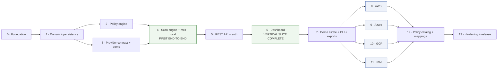

# Implementation Plan — v0.1.0

Status: accepted
Last updated: 2026-08-05

Ordered phases, each ending in a **working, demonstrable repository state**. A phase that leaves the
repository broken is not complete, regardless of how much code it landed.

Acceptance criteria referenced as `AC-*` are defined in
[acceptance-criteria.md](acceptance-criteria.md). Process gates are in
[definition-of-done.md](definition-of-done.md).

---

## Orientation



**The minimal vertical slice is Phases 0–6.** It runs a demo cloud connection through collection,
normalization, policy evaluation, persistence, API response, and dashboard display, with **one
collector and one policy**. Everything after Phase 6 is expansion along proven contracts.

Phase 4 is the first point of real value: `mcs scan --local --provider demo` produces findings with no
server, no database, and no network.

---

## Phase 0 · Foundation

**Objective.** A repository a contributor can clone, run, and get green CI on — before any domain code
exists.

**Files and modules.** `pyproject.toml`, `uv.lock`, `.python-version`, `ruff.toml`, `mypy.ini`,
`.importlinter`, `.pre-commit-config.yaml`, `src/multicloudshield/{__init__,config,api}/`,
`Dockerfile`, `compose.yaml`, `.env.example`, `.github/workflows/ci.yml`, `.gitignore`, `.dockerignore`.

**Functional behavior.** `docker compose up` starts PostgreSQL 18 and an API serving `/healthz` and
`/readyz`. Configuration loads from the environment, validates, and refuses to start on invalid input.
Structured JSON logging with the redaction processor on the root handler.

**Dependencies.** None.

**Security considerations.** Redaction processor installed before any other code can log. Container
runs as a non-root numeric user with `cap_drop: ALL`, `no-new-privileges`, and a read-only root
filesystem. CI workflow uses SHA-pinned actions and a read-only `GITHUB_TOKEN`. **The API startup
assertion that no provider credential environment variables are present lands here**, before there is
any provider code to tempt a shortcut.

**Tests.** Configuration validation (valid, invalid, dangerous combinations); redaction against the
credential-pattern corpus (AC-ENG-3); `/healthz` without database access; `/readyz` reporting migration
state.

**Acceptance criteria.** AC-ENG-2, AC-ENG-3, AC-ENG-4, AC-ENG-5 (partial), AC-ENG-6, AC-ENG-8, AC-API-7.

**Parallel work.** CI workflow, Dockerfile, and the tooling configuration are three independent tracks.

**Completion evidence.** CI green on a pull request; `docker compose up` output; `curl /healthz` and
`/readyz`; a log line demonstrating a redacted AWS key.

---

## Phase 1 · Core domain and persistence

**Objective.** The domain model exists, is typed, and persists — with the tenancy seam in place from
the first migration.

**Files and modules.** `core/` (enums, errors, `asset_urn`, fingerprints, severity rubric),
`facts/` (fact schemas, `TriState`, `EncryptionPosture`, `FactView`), `persistence/` (SQLAlchemy
models, `OrgScope`, repositories), `alembic/versions/0001_initial.py`.

**Functional behavior.** Every entity in [domain-model.md](../architecture/domain-model.md) exists as a
table. Migrations apply cleanly from empty. Repositories perform org-scoped CRUD. `asset_urn` and
finding fingerprints are computable and stable.

**Dependencies.** Phase 0.

**Security considerations.** `organization_id` on every tenant-scoped table **from this first
migration** — retrofitting is the migration that never gets done safely. `OrgScope` is a required
argument with no default and no unscoped variant, so omission is a type error. Enums stored as text
with check constraints. Application database role has DML but **no DDL** rights; migrations run under a
separate role.

**Tests.** Fact schema validation including `TriState` coercion; URN stability and uniqueness;
fingerprint stability under policy version and severity change, and uniqueness across `sub_locator`;
migration up/down; repository org-scoping including a test that cross-organization reads return
nothing; a structural test that every `TenantScoped` model has the column and a leading composite index.

**Acceptance criteria.** AC-ENG-1; foundations for AC-FIND-2 and AC-FIND-3.

**Parallel work.** `core`/`facts` and `persistence` can be built against the agreed model in parallel.

**Completion evidence.** `alembic upgrade head` on an empty database; the schema diagram; repository
tests including the cross-organization denial.

---

## Phase 2 · Policy engine

**Objective.** Policies load, validate, evaluate deterministically, and produce evidence — with no
cloud, no database, and no adapter in the picture.

**Files and modules.** `policy/` (loader, validator, `Verdict`, engine, helper predicates),
`policy/bundle/storage/public_read/` (the first policy: `MCS-STOR-001`), `tests/policy/`,
`tests/corpus/` (frozen fact corpus + golden file).

**Functional behavior.** The bundle loads and validates at startup; a malformed policy fails startup.
Evaluation dispatches on normalized resource type, returns the five-valued result, and records evidence
from the `FactView` access trace.

**Dependencies.** Phase 1 (`facts`).

**Security considerations.** Banned-import lint (network, filesystem, clock, environment, randomness)
in `policy/bundle/`. `provider_specific` reads force narrowed provider applicability at load. The
compliance-text check lands here — **before** there is a catalog to retrofit it onto.

**Tests.** Fixture tests for pass/fail/`insufficient_data`/`not_applicable`; `requires_facts` verified
against actual access; **the determinism golden-file job**; loader rejection cases; banned-import lint.

**Acceptance criteria.** AC-POL-1 through AC-POL-8.

**Parallel work.** The loader/validator and the evaluation engine are separable; the corpus harness is
independent of both.

**Completion evidence.** `pytest tests/policy` green offline; the determinism job passing twice; a
demonstration that a malformed policy fails startup with a precise message.

---

## Phase 3 · Provider contract and demo adapter

**Objective.** The adapter contract exists and has a complete, conformant implementation that needs no
cloud.

**Files and modules.** `providers/base.py` (protocols, `CollectionContext`, `RawObservation`,
`CapabilityReport`), `providers/registry.py`, `providers/errors.py` (classification taxonomy),
`providers/allowlist.py` (read-operation registry), `providers/demo/`, `tests/providers/conformance/`.

**Functional behavior.** A demo connection resolves scopes and runs one object-storage collector
producing normalized bucket facts. The conformance suite runs against every registered adapter.

**Dependencies.** Phases 1–2.

**Security considerations.** The read-only enforcement triad lands here: operation allowlist raising
before any request, CI mutating-verb check, conformance test with a raising client stub. The demo
generator has **no network access**, asserted by test. Normalization guardrails (size 5 MB, depth 32,
control-character stripping) land here as the validation boundary.

**Tests.** Full conformance suite; demo determinism (same estate every run); normalization guardrails
against oversized, deeply nested, and malformed payloads; the no-network assertion.

**Acceptance criteria.** AC-DEMO-4, AC-DEMO-5, AC-ENG-9.

**Parallel work.** Error classification, the allowlist registry, and the demo generator are three
tracks.

**Completion evidence.** Conformance suite green against demo; a recorded run showing an unlisted
operation raising before any request.

---

## Phase 4 · Scan engine and local CLI — first end-to-end

**Objective.** **The first real capability.** A scan runs end to end and produces findings, with no
server and no database.

**Files and modules.** `engine/` (orchestrator, fan-out, concurrency, retry, deadlines, cancellation,
sinks, finding reconciliation), `queue/` (`JobQueue` interface + procrastinate adapter), `worker/`,
`cli/` (`scan --local`), `alembic/versions/0002_job_queue.py`.

**Functional behavior.**

```bash
mcs scan --local --provider demo --output json --out findings.json
```

runs collection → normalization → evaluation → serialization, and exits `0`/`2`/`3`/`4`. The worker
claims jobs from PostgreSQL and persists results through the `PersistenceSink`.

**Dependencies.** Phases 1–3.

**Security considerations.** Bounded concurrency, page and item caps, timeouts, and deadlines (threat
T10). No retry on `permission_denied` — retrying an authorization failure only pollutes the customer's
audit log. Raw payloads discarded after normalization. **Finding reconciliation's positive-evidence
rule (threat T18) is implemented here**, and its regression gate is written in the same pull request.

**Tests.** Orchestrator fault injection (collector raises → target fails, scan continues); cancellation
observed within one page; **worker killed mid-scan → requeue → no duplicates**; idempotent replay; the
full reconciliation matrix from [testing-strategy.md](../architecture/testing-strategy.md) §6;
**AC-FIND-5, the total-failure regression gate**; the 10 000-asset load check.

**Acceptance criteria.** AC-SCAN-2 through AC-SCAN-9, AC-SCAN-11, AC-FIND-1 through AC-FIND-9,
AC-CLI-2, AC-CLI-3, AC-CLI-4, AC-CLI-5.

**Parallel work.** The queue adapter, the orchestrator, and reconciliation are separable behind
interfaces.

**Completion evidence.** `mcs scan --local --provider demo` output and its JSON; the fault-injection
and total-failure test runs; the load-check timing.

---

## Phase 5 · REST API and authentication

**Objective.** The scan engine becomes a multi-user service with real authentication and authorization.

**Files and modules.** `api/routers/` (connections, scans, assets, findings, policies, exports, auth,
tokens), `api/schemas/`, `api/auth/` (sessions, Argon2id, API tokens, CSRF), `api/errors.py`,
`api/deps.py`, `cli/` (remote mode), `alembic/versions/0003_auth.py`, `openapi.json` (committed).

**Functional behavior.** Bootstrap creates the organization and first `owner`. Connections are
registered with secret screening, tested, enabled/disabled. Scans start from the API and CLI. Findings
are listed, filtered, detailed, and status-changed with a reason. JSON and CSV exports work.

**Dependencies.** Phase 4.

**Security considerations.** The whole of T1, T3, T6, T7, T13, T17. Specifically: three-layer
`credential_reference` screening that **never echoes the offending value**; the route-enumeration audit
test; RBAC per role per route; cross-organization returning `404`; problem-details errors with no
internals; CSV formula neutralization; `__Host-`-prefixed session cookies with CSRF; token prefix +
checksum + SHA-256 at rest.

**Tests.** Route audit; RBAC matrix; cross-organization denial; secret-rejection cases with realistic
per-provider samples; error-model conformance; Schemathesis against the generated OpenAPI; export
correctness including the `=cmd|'/c calc'!A1` case.

**Acceptance criteria.** AC-CONN-1 through AC-CONN-8, AC-SCAN-1, AC-SCAN-10, AC-API-1 through AC-API-8,
AC-AUTH-1 through AC-AUTH-6, AC-CLI-1, AC-RPT-1 through AC-RPT-6.

**Parallel work.** Auth, resource routers, and exports are three tracks once the error model and
dependencies are agreed.

**Completion evidence.** The committed `openapi.json`; a recorded demo scan started via the API and
persisted; the route audit and RBAC test output; a CSV export showing a neutralized formula cell.

---

## Phase 6 · Dashboard — vertical slice complete

**Objective.** **The vertical slice closes.** A demo connection is visible from browser to cloud fact.

**Files and modules.** `web/` (Vite, React, TanStack Query, React Router, Tailwind, shadcn with a
pinned base), `web/src/api/` (generated client), all eleven views, `web/src/components/states/`
(empty, loading, partial-failure, error), Playwright E2E, Dockerfile frontend build stage.

**Functional behavior.** Login; overview; connections; scans with a live-updating scan detail including
errors; assets; findings with seven filters reflected in the URL; finding detail with evidence,
remediation, and compliance mappings; policy catalog. Demo banner throughout.

**Dependencies.** Phase 5.

**Security considerations.** Threat T16 in full: React escaping, `dangerouslySetInnerHTML` banned by
lint, CSP without `unsafe-inline`/`unsafe-eval`, `X-Frame-Options: DENY`, no third-party assets. The
hostile-string demo resource must render inert **everywhere** it appears.

**Tests.** Component tests for the four states of each list view; the hostile-string rendering test;
generated-client diff check; E2E: seed → scan → filter → finding detail → export, plus the
partial-failure view, plus `viewer` blocked from starting a scan.

**Acceptance criteria.** AC-UI-1 through AC-UI-9, AC-DEMO-1.

**Parallel work.** Build the **four states of the findings list first**, then reuse the pattern —
partial-failure states are otherwise discovered late, after the layout cannot accommodate them
(risk R-03). After that, views are parallelizable.

**Completion evidence.** Screenshots of all eleven views including every partial-failure state; the E2E
run; a clean-machine timing for AC-DEMO-1.

> **Milestone: the vertical slice is complete.** Demo connection → collection → normalization →
> evaluation → persistence → API → dashboard, with one collector and one policy. Everything after this
> point expands along contracts that are now proven.

---

## Phase 7 · Demo estate, CLI completion, exports

**Objective.** Demo becomes a genuine test surface for the paths that are hardest to reach against real
clouds.

**Files and modules.** `providers/demo/` (four synthetic estates, scripted behaviours),
`cli/` (all remaining commands), `api/routers/exports.py`, `docs/demo-workflow.md`.

**Functional behavior.** Demo estates for all four provider shapes, exercising: findings at every
severity, passes, `not_applicable`, **permission-denied → `insufficient_data`**, multi-page pagination
on ≥2 collectors, throttle-then-succeed retry, target failure → `partially_completed`,
`service_disabled` skip, `parse_error`, and hostile strings.

**Dependencies.** Phase 6.

**Security considerations.** Demo data must resemble no real organization. `is_demo` propagates to
connection, scan, asset, finding, and every export. The no-network assertion still holds.

**Tests.** AC-DEMO-3 asserted per behaviour; demo determinism across two seeds; full CLI coverage.

**Acceptance criteria.** AC-DEMO-1 through AC-DEMO-5, AC-CLI-1 through AC-CLI-5, AC-RPT-1 through
AC-RPT-6.

**Parallel work.** The four estates, the CLI commands, and the export formats are independent.

**Completion evidence.** A demo scan report showing every scripted behaviour occurring; two seed runs
diffed to zero.

---

## Phases 8–11 · Real providers

**These four phases are genuinely parallel** once Phase 7 lands. Each follows the same shape, and each
is independently shippable — a provider that overruns has its **collector count** cut, not its quality
(risk R-01), with the cut recorded in the coverage matrix.

**Common structure per provider.** `providers/<name>/{adapter,clients,collectors,normalizers}.py`;
fact-schema extensions; recorded fixtures (success, empty, multi-page, permission denied, malformed);
generated least-privilege role document; provider setup guide; coverage-matrix rows.

**Common security considerations.** Read-operation allowlist reviewed as a security control.
`required_permissions` declared per collector — this drives the generated role documents and the
`degraded` connectivity report. Fixtures scrubbed and CI-checked for real identifiers. Never request
more than read.

**Common tests.** Conformance suite; per-collector fixture tests for all five scenarios; error
classification per the [provider-adapters.md](../architecture/provider-adapters.md) §5 table;
connectivity test producing `ok`/`degraded`/`failed`.

**Common acceptance criteria.** AC-CONN-3, AC-CONN-4, AC-CONN-5, AC-SCAN-4, AC-SCAN-5, AC-SCAN-6.

### Phase 8 · AWS — the reference implementation

Ships **first** among providers: the broadest read-only API surface and the most mature SDK, so the
contract is validated against the easiest case before the harder ones.

Collectors: `s3.buckets`, `s3.account`, `ec2.security_groups`, `iam.principals`,
`cloudtrail.trails`, `kms.keys`.

Provider-specific work: per-region clients; regions from `ec2:DescribeRegions`, never hardcoded; S3
per-bucket calls routed via `GetBucketLocation` (else `301`); **CloudTrail shadow trails deduplicated
by `TrailARN`**; retry mode `adaptive` using `total_max_attempts` (not `max_attempts` — the two
disagree on whether the initial request counts); **`iam:GenerateCredentialReport` never called by
default** ([provider-coverage-matrix.md](provider-coverage-matrix.md) §7).

### Phase 9 · Azure

Collectors: `inventory.resources`, `storage.accounts`, `storage.containers`,
`network.security_groups`, `authorization.role_assignments`, `monitor.diagnostic_settings`,
`keyvault.vaults`.

Provider-specific work: **Resource Graph for discovery, management SDK for anything gating a finding**
(Resource Graph is an eventually-consistent replica); container `publicAccess` read from the **ARM
control plane**, never storage account keys (`listkeys` is a write action); `AZURE_TOKEN_CREDENTIALS=prod`
verified in the image; back off on `x-ms-ratelimit-remaining-subscription-reads`; budget for
`diagnostic_settings` being **per-resource**, which is the dominant cost of an Azure scan.

Risk: `azure-mgmt-authorization` stable is from 2023-07-25 (risk R-19). Use the stable release; do not
take a preview dependency.

### Phase 10 · GCP

Collectors: `inventory.assets`, `storage.buckets`, `compute.firewalls`, `iam.project_policy`,
`logging.audit_config`, `kms.keys`.

Provider-specific work: **`SERVICE_DISABLED` must never be read as "zero resources"** — it marks the
target `skipped` and dependent policies return `insufficient_data`; audit config read from
`auditConfigs` inside the IAM policy, returning `insufficient_data` at project scope because
parent-scope configuration is invisible; asymmetric KMS keys are `not_applicable` for rotation;
`ExportAssets` never called; documentation must state that `roles/viewer` is needed **in addition to**
`securityReviewer` for per-resource configuration.

### Phase 11 · IBM Cloud — scheduled last

Scheduled last because its SDK uncertainty is highest and must not block anything (risk R-05).

Collectors: `inventory.resources`, `cos.buckets`, `vpc.security_groups`, `vpc.network_acls`,
`iam.policies`, `iam.identity`.

Provider-specific work: `ibm-cos-sdk` imports **isolated** — it vendors its own botocore fork and can
conflict in one environment; `ibm-vpc` API **version date pinned explicitly**; both platform and
service roles documented per service instance.

**Audit logging and KMS are declared not covered**, with the reason recorded in the coverage matrix
([provider-coverage-matrix.md](provider-coverage-matrix.md) §6.3): no maintained official Python SDK
exists for Activity Tracker, Cloud Logs, Key Protect, or HPCS. Implementing them against a stale
third-party client would be worse than declaring the gap.

**Completion evidence per provider.** Conformance suite green; fixture tests for all five scenarios per
collector; the generated least-privilege policy document; the coverage matrix rows including anything
cut and why.

---

## Phase 12 · Policy catalog and compliance mappings

**Objective.** The full 23-policy catalog, with mappings that are legally safe.

**Files and modules.** `policy/bundle/**` (remaining policies + fixtures), compliance mapping metadata,
`NOTICE`, `docs/policy-catalog.md` (generated).

**Functional behavior.** All policies in [provider-coverage-matrix.md](provider-coverage-matrix.md) §8
implemented, each with pass/fail/`insufficient_data` fixtures. Compliance mappings render as labels
with the standing disclaimer.

**Dependencies.** Phases 8–11 (facts must exist before policies can read them).

**Security considerations.** Threat T18: every policy handles `unknown` before its failure branch.
Threat "copyright": the compliance-text check runs over the whole catalog; **no compliance score,
percentage, or pass-rate is implemented anywhere** ([ADR-0024](../architecture/decisions/0024-compliance-mapping-policy.md)).

**Tests.** Per-policy fixtures; catalog-wide conformance; the determinism golden file regenerated and
**reviewed as a behaviour change**; the compliance-text check.

**Acceptance criteria.** AC-POL-1 through AC-POL-8, AC-FIND-1.

**Parallel work.** Policies are independent of each other — the most parallelizable phase, and the
natural place for new contributors.

**Completion evidence.** The generated policy catalog; the coverage matrix generated from code and
matching the committed document; the determinism job green.

---

## Phase 13 · Hardening and release

**Objective.** v0.1.0 is shippable and honest about what it is.

**Files and modules.** `.github/workflows/release.yml`, SBOM and attestation steps, `SECURITY.md`
verification, `README.md` final pass, per-provider setup guides, release notes, `CHANGELOG.md`.

**Functional behavior.** Tagging produces a wheel published via PyPI Trusted Publishing, an SBOM, and a
provenance attestation.

**Dependencies.** Phase 12.

**Security considerations.** Full threat-model review against the implementation — every mitigation
marked implemented must name a test or structural control. Container scan clean at high/critical.
Dependency scan clean or every exception documented with a rationale and expiry. Confirm by inspection
**and** automated check that no cloud write path exists.

**Tests.** The full suite plus both release gates; a clean-machine 10-minute quickstart verified **by
someone who did not write the documentation**.

**Acceptance criteria.** The whole of [definition-of-done.md](definition-of-done.md) §3.

**Parallel work.** Documentation, release workflow, and the security review are three tracks.

**Completion evidence.** The `v0.1.0` tag; the release artefacts with SBOM and attestation; the
threat-model review sign-off; the recorded quickstart.

---

## Scope boundaries

### v0.1.0 requirements

Everything in Phases 0–13, matching [mvp-scope.md](../product/mvp-scope.md) "In".

### Post-MVP — planned, not now

Scheduled scans (procrastinate already provides periodic tasks); finding trend and drift over time;
OIDC SSO via the existing `AuthProvider` seam; PostgreSQL row-level security; per-connection
authorization; organization/folder/management-group hierarchy scanning (which would also resolve GCP's
audit-config limitation); bulk inventory APIs as collectors behind the same contract; suppression rules
as data; user-authored policies via CEL; policy parameters per connection; SARIF export; HTML report;
notification integrations (**requiring the full SSRF treatment** in
[threat-model.md](../architecture/threat-model.md) §T4); published signed container images;
TypeScript 7 migration; Kubernetes manifests; additional collectors and providers.

### Intentionally deferred

| Deferred | Reason |
| --- | --- |
| **Automated remediation** | The defining constraint of this product. If ever built, a separate, separately-permissioned, opt-in component with its own credential path — never a flag on the scanner |
| PDF generation | Needs a headless browser or heavy templating; disproportionate attack surface and image weight for the value |
| Compliance scores or percentages | Prohibited by CIS terms and misleading regardless |
| Multi-tenancy with hard isolation | The seam exists; the feature is unvalidated |
| Data-plane inspection | Permanently out of scope. No collector may read object contents or database rows |
| Kafka, Redis, Elasticsearch, Kubernetes | No demonstrated MVP need |
| Real-time push to the dashboard | Polling is sufficient at MVP scan volumes |
| Live cloud credentials in CI | The exact anti-pattern this product detects |

---

## Sequencing notes for whoever implements this

1. **Do not reorder Phases 2 and 3 ahead of Phase 1.** The fact schema is the contract everything else
   depends on; getting it wrong early is cheap to fix and expensive to fix late.
2. **Phase 4 is the highest-risk phase** and contains the two release-gate tests. Budget accordingly;
   it is not "just wiring".
3. **Build the findings list's four states before the second view** (risk R-03).
4. **AWS before the other providers.** It validates the adapter contract against the easiest case. If
   the contract is wrong, it is cheaper to discover once than four times.
5. **A provider that overruns loses collectors, not quality.** Record the cut in the coverage matrix.
6. **Policies come after their facts.** A policy written against a fact that does not exist yet is a
   policy written twice.
